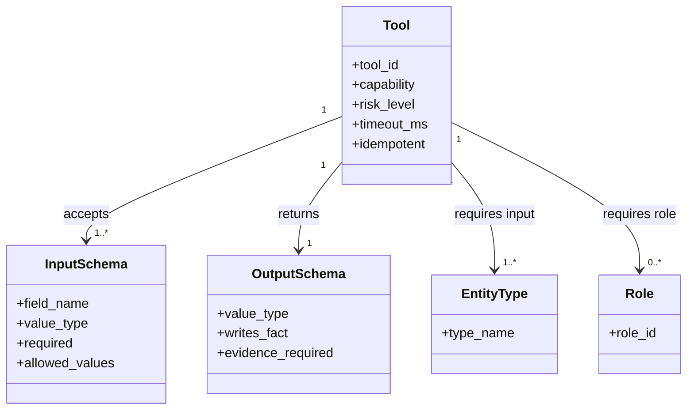
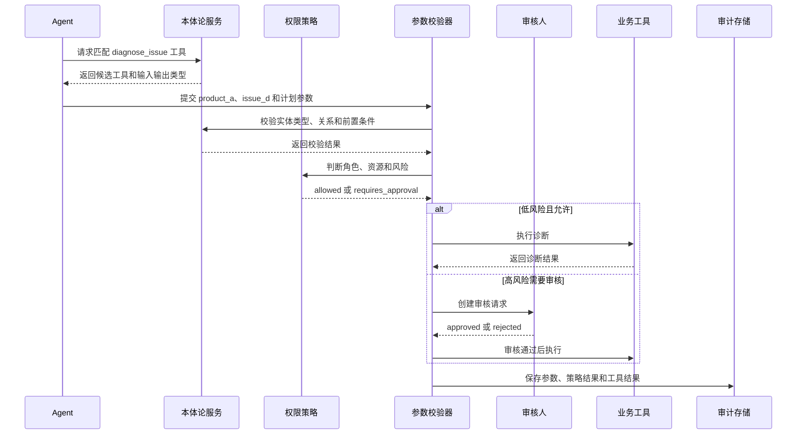
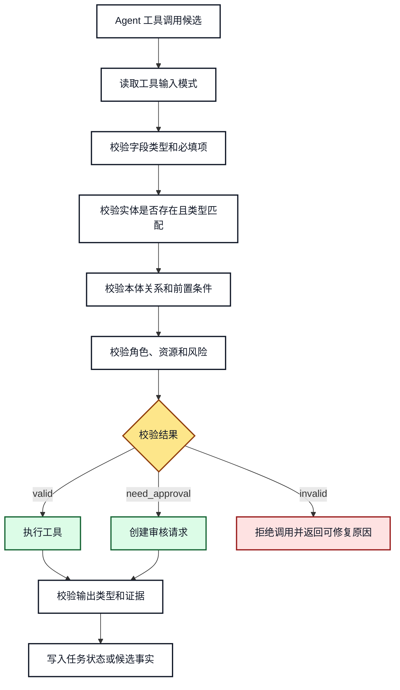

# 14. 本体论驱动工具选择、参数校验和结果约束

## 本章目标

- 用本体描述工具能力、输入类型、输出类型和前置条件。
- 根据用户目标和语义实体选择工具。
- 在工具执行前完成类型、必填项、权限和风险校验。
- 将工具结果转换为事实、证据或任务状态，而不是盲目写入知识图谱。

## 1. 工具也是领域对象

工具不只是一个 Python 函数。对 Agent 来说，一个可安全调用的工具至少需要描述：

```text
工具名称、能力、输入类型、输出类型、前置条件、所需角色、风险等级、幂等性和超时
```



**图 14-1：工具能力本体的最小模型**

工具元数据用于“选择前”和“执行前”两个阶段。模型可以根据能力描述提出工具候选，但最终调用必须经过确定性的校验器。

## 2. 工具选择时序



**图 14-2：工具调用前后的安全边界**

工具选择、参数校验、权限判断和实际执行是四个不同步骤。审核通过只代表当前动作被批准，不代表所有后续动作都自动获得授权。

## 3. 参数校验流程



**图 14-3：工具参数和输出约束**

输出也需要校验。工具返回的字符串不能自动变成领域事实，只有符合输出模式、带有来源并通过写入策略的结果，才可以进入知识层。

## 4. 工具描述示例

```json
{
  "tool_id": "diagnose_login",
  "capability": "diagnose_issue",
  "input": {
    "product_id": {"type": "Product", "required": true},
    "issue_id": {"type": "Issue", "required": true},
    "dry_run": {"type": "boolean", "required": true}
  },
  "output": {"type": "DiagnosisReport", "evidence_required": true},
  "preconditions": ["Issue affects Feature", "Product owns Feature"],
  "required_roles": ["support_engineer"],
  "risk_level": "medium",
  "idempotent": true
}
```

## 5. 结果回写策略

| 工具结果 | 默认处理 | 原因 |
|---|---|---|
| 查询结果 | 写入执行记录和证据 | 结果可能随时间变化 |
| 诊断报告 | 写入任务记忆 | 属于当前任务产物 |
| 用户明确确认的事实 | 进入候选事实队列 | 仍需来源和冲突校验 |
| 配置变更结果 | 写入审计和业务系统 | 不能只写知识图谱 |
| 模型总结 | 不直接写为事实 | 可能包含推断或幻觉 |

## 6. 常见错误和排查

- **只校验 JSON 类型，不校验领域类型**：字符串 `product_a` 仍可能不是 `Product`。
- **让工具自己决定权限**：权限判断应在统一策略层完成，并保留审计记录。
- **把审核结果缓存成永久授权**：授权通常绑定主体、资源、动作和时间窗口。
- **工具执行成功就自动更新本体事实**：执行结果和领域事实需要不同的写入策略。

## 7. 练习和自查

1. 为“发布解决方案文档”描述输入、输出、角色和风险等级。
2. 设计一个 `dry_run` 参数，说明它如何降低高风险工具的默认风险。
3. 列出工具失败、输出类型错误和权限拒绝的不同处理方式。

## 本章小结

本体论让工具调用具备语义契约。Agent 负责选择候选工具，校验器负责确定能否调用，权限和审核负责控制高风险动作，执行结果则按类型和来源分别落库。

