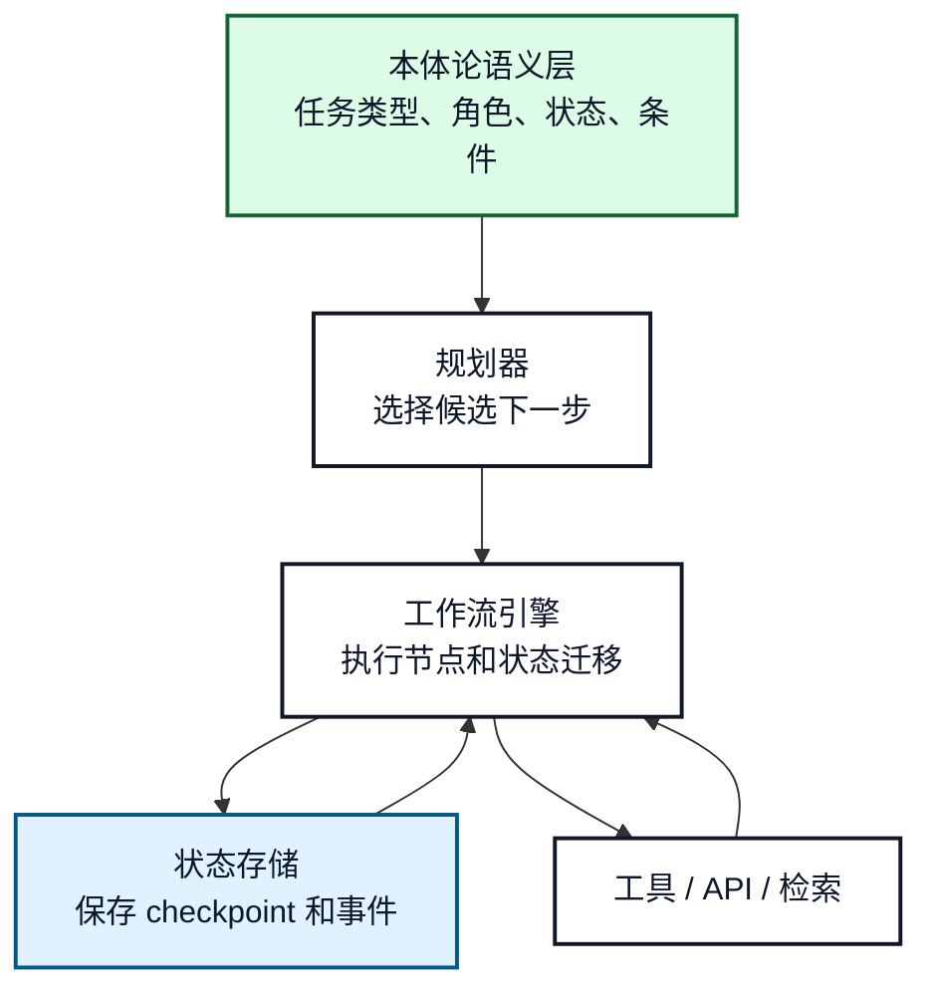
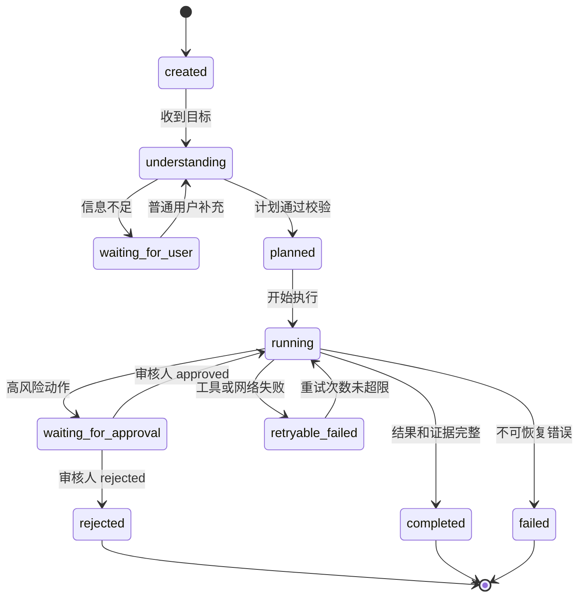

# 15. 本体论与工作流：任务、状态和前置条件

## 本章目标

- 用本体表达任务、角色、状态、前置条件和后置条件。
- 理解本体论如何帮助工作流选择下一步，而不是替代工作流引擎。
- 设计可恢复、可观测和可审计的 Agent 工作流。

## 1. 语义层和执行层的分工



**图 15-1：本体论与工作流引擎的边界**

本体论描述哪些状态和迁移在业务上有意义，规划器从中选择候选步骤，工作流引擎负责真正执行、暂停、恢复和持久化。

## 2. 任务状态模型



**图 15-2：本体约束下的任务状态机**

状态名称应反映业务语义，不能只用 `step_1`、`step_2`。每个状态都需要定义进入条件、允许动作、退出条件和失败去向。

## 3. 前置条件和后置条件

以“自动修复登录失败”为例：

```text
任务类型：RemediateIssue

前置条件：
- 当前主体已经确认 Product 和 Issue
- Issue 影响的 Feature 属于该 Product
- 诊断工具已经返回可执行建议
- 当前主体拥有 remediation 权限
- 高风险动作已经 approved

执行动作：
- 调用配置变更工具，使用 dry_run 或正式模式

后置条件：
- 业务系统返回变更结果
- 任务记录包含工具输入、输出和证据
- 知识图谱只写入经过验证的结果
```

## 4. 正常、失败和恢复路径

```mermaid
flowchart TD
    A[创建任务] --> B[理解用户目标]
    B --> C{条件完整?}
    C -->|否| D[等待普通用户补充]
    D --> B
    C -->|是| E[生成并校验计划]
    E --> F[执行查询或诊断]
    F --> G{工具结果}
    G -->|成功| H[形成证据包]
    G -->|可重试失败| I[记录失败事件]
    I --> J{超过重试上限?}
    J -->|否| F
    J -->|是| K[降级或人工接管]
    G -->|高风险动作| L[等待审核人]
    L -->|批准| F
    L -->|驳回| M[结束并说明原因]
    H --> N[完成任务]

    classDef normal fill:#DCFCE7,stroke:#166534,color:#0F172A,stroke-width:2px;
    classDef decision fill:#FDE68A,stroke:#92400E,color:#0F172A,stroke-width:2px;
    classDef failure fill:#FEE2E2,stroke:#991B1B,color:#0F172A,stroke-width:2px;
    class A,B,D,E,F,H,L,N normal;
    class C,G,J decision;
    class I,K,M failure;
```



**图 15-3：工作流恢复路径**

恢复的关键不是重新生成一遍计划，而是从持久化状态读取已确认实体、已完成步骤、重试次数和待审核动作。这样可以避免重复执行不可逆操作。

## 5. Agent 自主规划的边界

适合让 Agent 规划：

- 从允许的查询步骤中选择顺序。
- 选择图查询、文档检索或低风险诊断工具。
- 根据结果决定是否需要澄清。

不适合完全交给 Agent：

- 权限授予和权限绕过。
- 高风险配置变更。
- 审核状态修改。
- 不可逆数据删除。

这些动作应由固定工作流、策略引擎或人工审核控制。

## 6. 常见错误和排查

- **把本体状态当成运行时状态**：本体定义状态类型，任务存储保存当前实例状态。
- **恢复时重新调用已完成工具**：每个副作用步骤必须有幂等键和完成记录。
- **只有成功路径，没有失败状态**：至少区分可重试失败、不可恢复失败、拒绝和取消。
- **用模型输出直接决定状态迁移**：迁移必须经过允许边和前置条件校验。

## 7. 练习和自查

1. 为“发布解决方案文档”设计任务状态机。
2. 为每个状态写出进入条件和允许的下一状态。
3. 说明工具超时后如何恢复，如何防止重复副作用。

## 本章小结

本体论为工作流提供语义 vocabulary 和约束，工作流引擎负责运行时状态迁移。两者结合后，Agent 的自主性被限制在可解释、可恢复和可审计的业务边界内。

