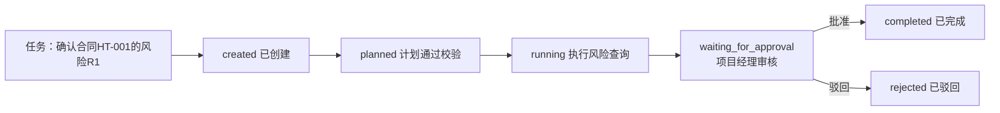
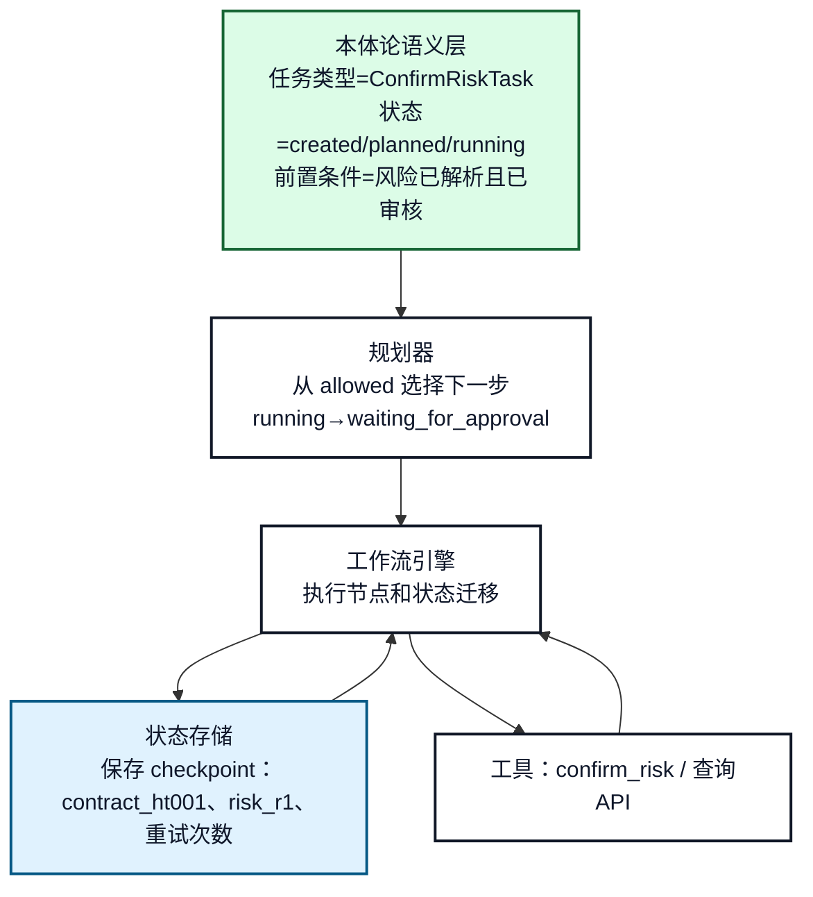
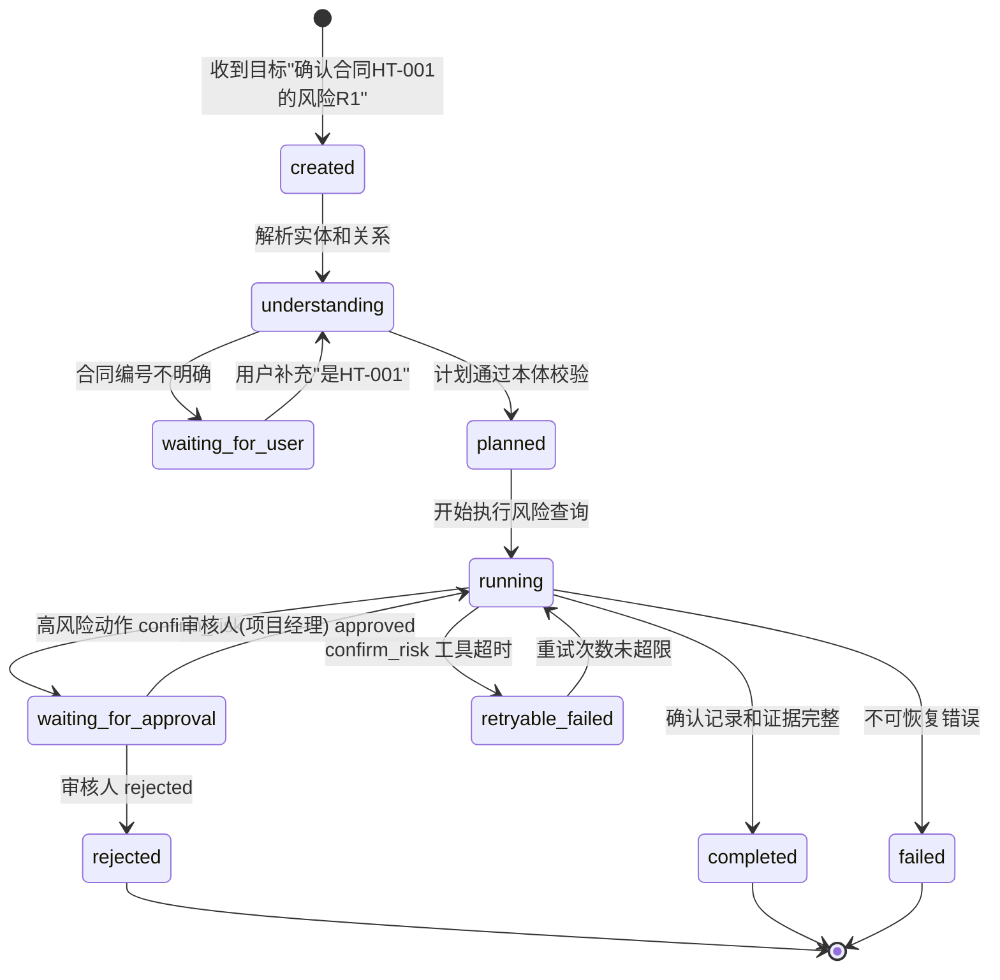
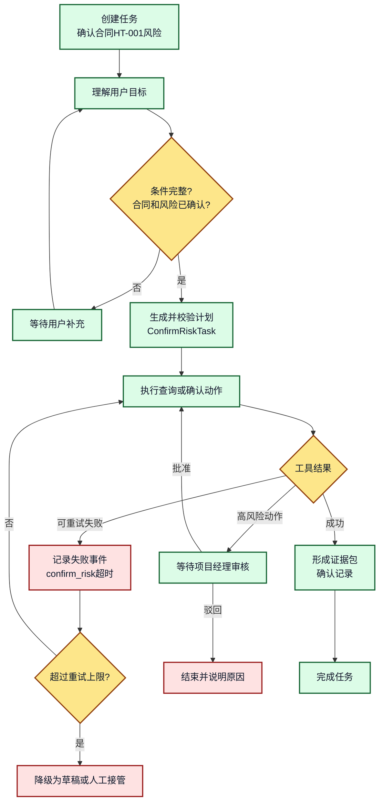

# 15. 本体论与工作流：任务、状态和前置条件

## 一分钟看懂本章

> **一句话**：工作流不是让 Agent 自由乱跑——本体定义"任务类型 + 状态 + 前置条件"，比如"确认合同风险"必须先有"合同已解析、风险已标记"，Agent 只能选择允许的下一步。



**读图要点**：状态不是 `step_1`、`step_2`，而是**带业务语义**的状态（计划、等待审核、完成/驳回）。"等待审核"和"失败"都是正常状态，谁从哪来、谁能到哪，都由本体的允许迁移边决定。

## 本章目标

- 用本体表达任务、角色、状态、前置条件和后置条件。
- 理解本体论如何帮助工作流选择下一步，而不是替代工作流引擎。
- 设计可恢复、可观测和可审计的 Agent 工作流。

## 1. 语义层和执行层的分工

## 1.1 真实例子：合同风险确认走的是固定工作流

项目经理要求："**确认合同 HT-001 的风险 R1，并生成确认记录**"

```text
工作流节点：
  created              创建任务，绑定 contract_ht001 和 risk_r1
  planned              查询计划通过本体校验（hasRisk 关系存在）
  running              读取风险详情，调用 confirm_risk 工具
  waiting_for_approval risk_level=high，挂起等项目经理审核
  completed            审批通过，生成确认记录并写入候选事实
  rejected             驳回，结束并说明原因
```

"下一步去哪"不是模型随口决定的，而是查本体里的允许迁移：

```python
def next_states(task: Task, ontology: Ontology) -> list[str]:
    allowed = ontology.allowed_transitions(task.type)     # ConfirmRiskTask: running->[waiting_for_approval, retryable_failed]
    if task.risk_level == "high" and "approval" in allowed:
        return ["waiting_for_approval"]                   # 高风险强制先走审核
    return [s for s in allowed if task.preconditions_satisfied(s)]
```



**图 15-1：本体论与工作流引擎的边界**

**读图要点**：本体只"说定义"——什么任务类型、哪些状态、什么前置条件（左侧绿色层）；规划器从允许集合里挑下一步；工作流引擎真正执行、暂停、恢复和持久化（右侧白色层）；checkpoint 里存的是**具体业务对象**（合同HT-001、风险R1、重试次数），不是抽象编号。

## 2. 任务状态模型



**图 15-2：本体约束下的任务状态机**

**读图要点**：状态名都带业务语义（`waiting_for_approval` 就是"等项目经理审核"）。每个状态的进入条件、允许动作、退出条件和失败去向都是**显式定义**的——比如只有 `approved` 才能从等待审核回到 running，`rejected` 直接终态。

## 3. 前置条件和后置条件

以"自动修复登录失败"为例：

```text
任务类型：RemediateIssue

前置条件：
- 当前主体已经确认 Product 和 Issue
- Issue 影响的 Feature 属于该 Product
- 诊断工具已经返回可执行建议
- 当前主体拥有 remediation 权限
- 高风险动作已经 approved

执行动作：
- 调用配置变更工具，使用 dry_run 或正式模式

后置条件：
- 业务系统返回变更结果
- 任务记录包含工具输入、输出和证据
- 知识图谱只写入经过验证的结果
```

换成合同系统的"确认风险"任务，规则完全一样：

```text
任务类型：ConfirmRiskTask

前置条件：
- 已确认 Contract（合同HT-001）和 Risk（风险R1）
- 风险R1 所属的 Project（项目AAA）在当前用户租户内
- confirm_risk 工具 dry_run 校验通过
- 当前主体拥有 project_manager 角色
- 高风险动作已经 approved

执行动作：
- 调用 confirm_risk 工具，使用 dry_run 或正式模式

后置条件：
- 业务系统返回确认结果
- 任务记录包含工具输入、输出和证据
- 知识图谱写入 RiskR1 状态=已确认（带来源）
```

## 4. 正常、失败和恢复路径



**图 15-3：工作流恢复路径**

**读图要点**：重点看失败分支——工具超时先"记录失败事件"再重试，超过上限才降级；高风险动作一律挂起等审核。恢复的关键是**从持久化状态读取**已确认实体、已完成步骤、重试次数和待审核动作，而不是重新生成一遍计划——这样才能避免重复执行不可逆操作。

## 5. Agent 自主规划的边界

适合让 Agent 规划：

- 从允许的查询步骤中选择顺序（先查风险列表，再决定是否确认）。
- 选择图查询、文档检索或低风险诊断工具。
- 根据结果决定是否需要澄清（合同编号有歧义时先问）。

不适合完全交给 Agent：

- 权限授予和权限绕过。
- 高风险配置变更（如让合同"直接生效"）。
- 审核状态修改（不能自己批准自己的动作）。
- 不可逆数据删除。

这些动作应由固定工作流、策略引擎或人工审核控制。

## 6. 常见错误和排查

- **把本体状态当成运行时状态**：本体定义状态类型，任务存储保存当前实例状态。
- **恢复时重新调用已完成工具**：每个副作用步骤必须有幂等键和完成记录。
- **只有成功路径，没有失败状态**：至少区分可重试失败、不可恢复失败、拒绝和取消。
- **用模型输出直接决定状态迁移**：迁移必须经过允许边和前置条件校验。

## 7. 练习和自查

1. 为“发布解决方案文档”设计任务状态机。
2. 为每个状态写出进入条件和允许的下一状态。
3. 说明工具超时后如何恢复，如何防止重复副作用。

## 本章小结

本体论为工作流提供语义 vocabulary 和约束，工作流引擎负责运行时状态迁移。两者结合后，Agent 的自主性被限制在可解释、可恢复和可审计的业务边界内。

