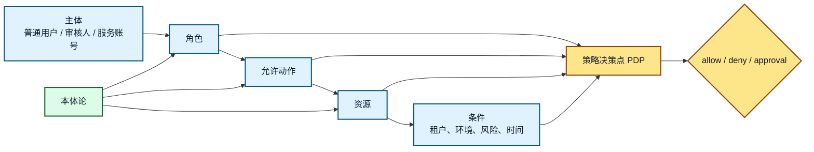
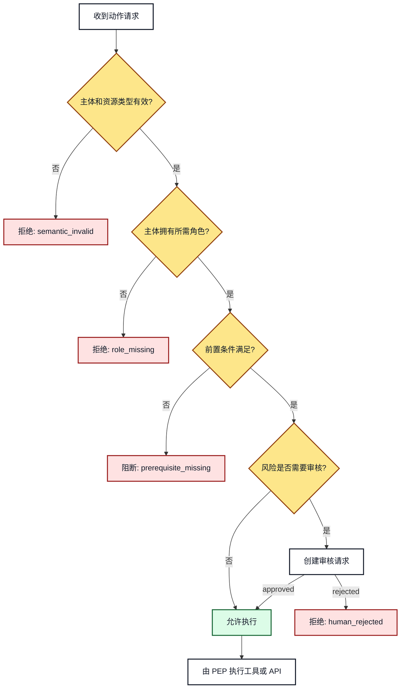
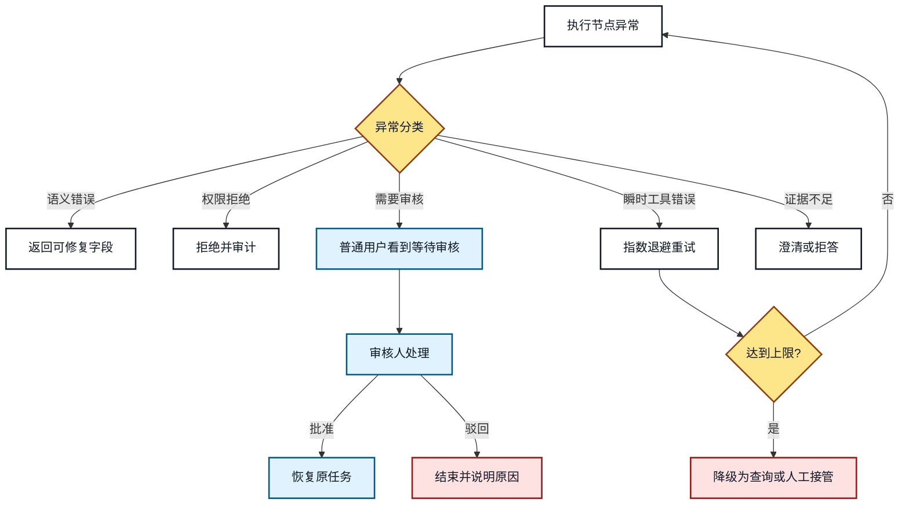

# 16. 本体论与权限、安全边界和异常处理

## 本章目标

- 用主体、角色、资源和动作描述权限关系。
- 区分本体语义判断、策略决策和业务执行。
- 识别类型错误、事实冲突、权限拒绝和工具失败。
- 设计重试、降级、人工接管和审计闭环。

## 1. 权限模型的四个核心对象



**图 16-1：本体论、权限策略和执行边界**

本体论定义角色、资源和动作的语义关系；PDP 根据当前主体、资源、动作和上下文做策略决策；PEP 在工具或 API 入口处执行决策。三者不能混为一个 Prompt。

## 2. 权限决策树



**图 16-2：权限判断和拒绝路径**

拒绝原因要结构化返回，便于前端展示、Agent 澄清和审计分析。`deny`、`blocked` 和 `requires_approval` 的语义不同，不能都返回“无权限”。

## 3. 异常分类

| 异常类别 | 示例 | 默认处理 |
|---|---|---|
| `semantic_invalid` | 输入实体不是 `Product` | 不重试，要求修正或澄清 |
| `data_conflict` | 两个来源给出不同模块 | 标记冲突，降低结论置信度 |
| `permission_denied` | 角色不能访问资源 | 拒绝并记录审计 |
| `approval_required` | 高风险动作需要审核 | 创建审核请求并暂停任务 |
| `tool_timeout` | 业务 API 超时 | 有界重试，超过上限后降级 |
| `tool_failed` | 工具返回业务错误 | 根据错误码决定重试或人工接管 |
| `evidence_insufficient` | 证据不足以回答 | 澄清、拒答或给出不确定性 |

## 4. 异常处理和人工接管



**图 16-3：异常分类、重试、降级和人工接管**

恢复动作取决于异常类别：语义错误需要补充输入，工具超时可以有限重试，高风险动作需要审核，证据不足则不能用重试掩盖知识缺口。

## 5. 审计记录

关键动作至少记录以下字段：

```json
{
  "event_type": "tool_call_denied",
  "user_id": "user-001",
  "task_id": "task-001",
  "thread_id": "thread-001",
  "tool_id": "apply_config_change",
  "resource_id": "product_a",
  "decision": "requires_approval",
  "reason_code": "high_risk_action",
  "policy_version": "policy-v3",
  "created_at": "2026-08-23T10:05:00+08:00"
}
```

审计记录的作用是回答“谁在什么任务中，基于哪个策略，对哪个资源提出了什么动作，结果如何”。它不应只保存最终答案。

## 6. 安全边界原则

1. Agent 不能自行提升角色或修改权限。
2. 模型输出不能绕过 PEP、PDP 和业务 API 的校验。
3. 审核人批准的是明确的动作、资源和参数，不是整个任务的无限授权。
4. 高风险动作默认使用 `dry_run`，正式执行必须有显式授权。
5. 失败降级不能泄露原本无权访问的证据。

## 7. 常见错误和排查

- **只在 Prompt 中说明权限**：Prompt 不是安全边界，必须在服务端强制执行。
- **所有拒绝都自动重试**：权限拒绝和语义错误通常重试无效。
- **审核人和普通用户混用身份**：审核动作必须有独立主体、角色和审计记录。
- **异常信息过于详细**：向普通用户返回可行动原因，但不要泄露内部策略和敏感资源。

## 8. 练习和自查

1. 为“发布解决方案文档”定义普通用户、审核人和服务账号的权限。
2. 设计 `requires_approval` 到 `approved` 的状态迁移条件。
3. 为工具超时、权限拒绝和证据不足分别设计响应结构。

## 本章小结

本体论提供权限和异常处理所需的语义对象，但不直接承担安全执行职责。真正可靠的系统必须把本体校验、策略决策、执行拦截、人工审核和审计记录连成闭环。
