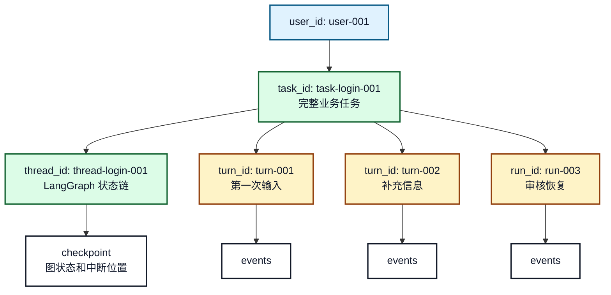
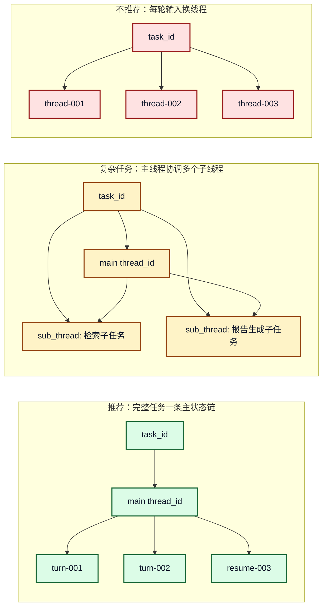
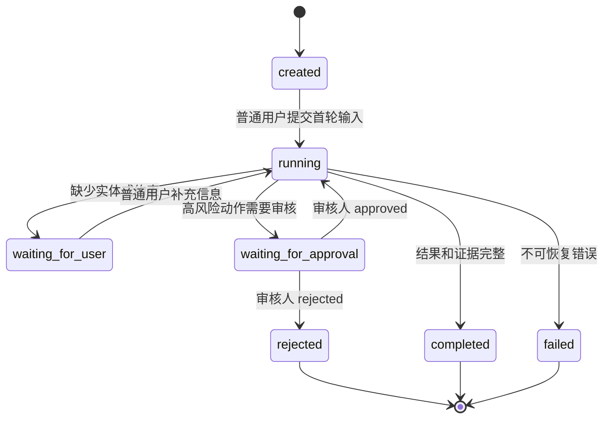

# 17. 多轮对话中的实体、关系和状态管理

## 本章目标

- 区分 `user_id`、`task_id`、`thread_id`、`turn_id/run_id` 的职责。
- 理解一个完整任务中多轮用户输入如何复用同一条状态链。
- 处理普通用户、审核人和 Agent 在同一任务中的状态边界。
- 设计并发、幂等和审计所需的事件记录。

## 1. 四类 ID 的职责边界

多轮 Agent 系统里，最容易混淆的是“用户多发了几句话”是否意味着要新建任务或线程。建议先把四类 ID 固定下来：

| ID | 表示什么 | 生命周期 | 典型用途 |
|---|---|---|---|
| `user_id` | 当前登录主体 | 用户账号生命周期 | 认证、权限、任务归属 |
| `task_id` | 一个完整业务目标 | 从创建到完成/取消 | API 查询、任务状态、最终结果、审核单 |
| `thread_id` | 一条 LangGraph checkpoint 状态链 | 通常跟随任务 | 图恢复、中断恢复、状态延续 |
| `turn_id/run_id` | 某一次输入触发的执行 | 单次输入或单次恢复 | 流式事件、日志、耗时、重试 |

默认推荐关系：**一个 `task_id` 对应一个主 `thread_id`，一个 `task_id` 下有多个 `turn_id/run_id`**。



**图 17-1：`user_id`、`task_id`、`thread_id` 和 `turn_id/run_id` 关系**

这张图的关键结论是：用户多次发送消息，并不自动产生多个任务。只要仍在完成同一个业务目标，就应该复用同一个 `task_id` 和主 `thread_id`，每次输入只新增 `turn_id/run_id`。

## 2. `task_id` 能否对应多个 `thread_id`

工程上可以，但不要默认这么做。

推荐规则：

1. **普通任务：`task_id -> 1 个主 thread_id`**。多轮对话、恢复执行、人工审核都使用这条主状态链。
2. **复杂任务：`task_id -> 1 个主 thread_id + 多个子 thread_id`**。只有当任务被拆成多个相对独立的子流程，并且每个子流程需要独立 checkpoint 时才使用。
3. **不要每轮用户输入都新建 `thread_id`**。这样会切断 LangGraph 的状态恢复能力，也会让上下文延续变成手工拼接。



**图 17-2：一个任务对应一个线程还是多个线程**

如果只是“用户为了完成同一件事发了多条消息”，仍然是一个任务、一条主线程、多个 turn。多个 `thread_id` 适合并行子任务，而不是普通多轮对话。

## 3. 多轮输入状态机



**图 17-3：多轮任务状态机**

普通用户补充信息和审核人提交反馈是两类不同事件。普通用户补充的是任务输入，审核人反馈的是对某个风险动作的批准或驳回，二者都可以触发新的 `turn_id/run_id`，但权限和状态迁移规则不同。

## 4. 普通用户和审核人的边界

| 角色 | 能做什么 | 不能做什么 |
|---|---|---|
| 普通用户 | 发起任务、补充信息、查看自己可见的结果 | 批准高风险动作、绕过权限 |
| 审核人 | 查看审核材料、批准或驳回指定动作 | 修改普通用户的原始输入、获得无限授权 |
| Agent | 规划、查询、调用低风险工具、生成证据包 | 自行提升权限、伪造审核结果 |
| 后端服务 | 校验身份、创建任务、调用图、保存事件 | 信任前端传入的任意 `thread_id` |

前端可以传 `task_id`，但不应该直接决定 `thread_id`。后端应根据 `task_id` 查业务任务，再拿内部保存的 `thread_id` 调用 LangGraph。

## 5. 事件记录模型

```json
{
  "event_id": "event-009",
  "user_id": "user-001",
  "task_id": "task-login-001",
  "thread_id": "thread-login-001",
  "turn_id": "turn-002",
  "actor_role": "normal_user",
  "event_type": "user_message",
  "payload": {"text": "补充一下，是产品 A 的线上环境"},
  "created_at": "2026-08-23T11:00:00+08:00"
}
```

事件记录要能回答：谁、在哪个任务、哪一轮执行、触发了什么事件、状态如何变化。它和 checkpoint 不同，checkpoint 用于恢复图，事件用于查询、审计和前端展示。

## 6. 并发和幂等

同一个 `thread_id` 不应该被多个请求同时写入。后端需要对同一任务做串行化处理：

1. 用户连续发送两条消息时，第二条等待第一条完成或进入可接收输入状态。
2. 审核人重复点击提交时，用 `approval_id` 或 `idempotency_key` 去重。
3. 恢复执行时必须使用原任务的 `thread_id`。
4. 副作用工具必须保存执行记录，避免恢复或重试时重复执行。

## 7. 练习和自查

1. 为“企业知识助手诊断产品登录失败”设计任务表、运行表和事件表字段。
2. 说明用户连续补充三次信息时，哪些 ID 保持不变，哪些 ID 新增。
3. 设计审核人重复提交同一个审批结果时的幂等策略。

## 本章小结

`task_id` 管业务目标，`thread_id` 管图状态恢复，`turn_id/run_id` 管单次输入和执行记录。普通多轮对话默认复用同一个主 `thread_id`，只有复杂并行子任务才考虑多个子线程。
