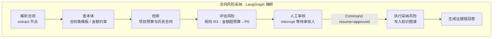
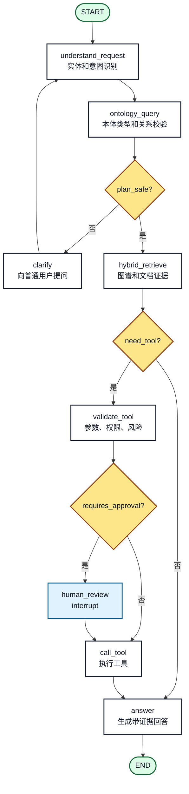
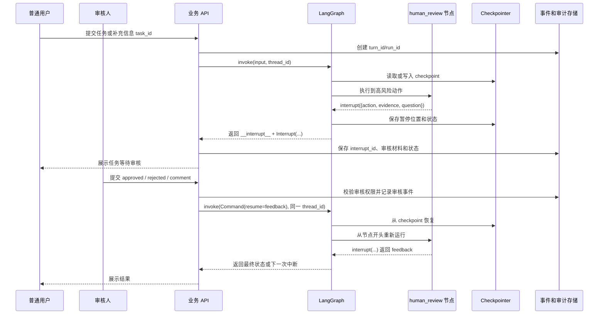
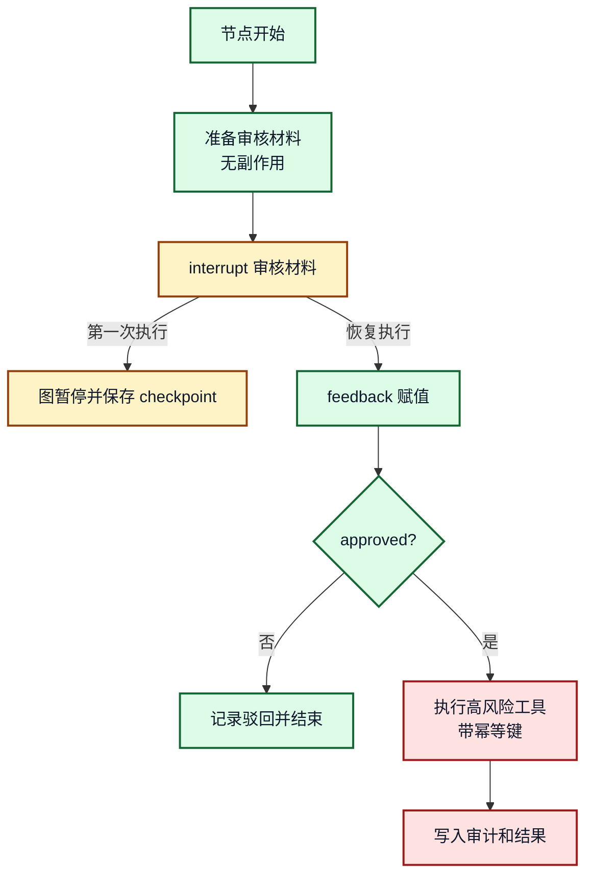

# 18. 使用 LangGraph 编排本体查询、Agent、工具和 HITL

## 一分钟看懂本章

> **一句话**：用 LangGraph 把"解析合同→查本体→检索→评估风险→人工审核→执行采纳"编排成一张可中断、可恢复的图；`interrupt()` 暂停等审核，`Command(resume=...)` 在审核人批准后恢复执行。



> **读图要点**：图里只有"人工审核"会暂停执行，其余节点自动跑完；审核人批准后，图从 interrupt 节点恢复，而不是从头重跑整个流程。

## 本章目标

- 把本体查询、混合检索、工具调用和人工审核编排成一张图。
- 解释 `interrupt()`、返回结构里的 `Interrupt(...)` 和 `Command(resume=...)` 的区别。
- 理解恢复执行会重新运行触发中断的节点。
- 设计普通用户和审核人参与的 HITL 完整时序。

## 真实例子：合同风险采纳的 HITL

用户问："HT-001 的预算超限风险可以采纳吗？" 系统判断"采纳风险"属于高风险动作，不能由 Agent 自动执行，必须中断等待审核人批准。

**关键代码 1：审核节点用 `interrupt()` 暂停，把审核材料交给外部**

```python
from langgraph.types import interrupt

def human_review(state):
    # interrupt() 之前的代码必须无副作用：恢复执行时该节点会从头重跑
    feedback = interrupt({
        "task_id": state["task_id"],          # task-contract-ht001
        "action": "accept_risk",              # 采纳风险
        "evidence": {"rule": "R3", "budget": 8_500_000, "limit": 8_000_000},
        "question": "合同 HT-001 金额 850 万超出预算上限 800 万，是否批准采纳该 P0 风险？",
    })
    return {"approval": feedback}  # {"decision": "approved", "comment": "..."}
```

**关键代码 2：后端把审核人的反馈包装成恢复指令**

```python
from langgraph.types import Command

graph.invoke(
    Command(resume={"decision": "approved", "comment": "同意采纳"}),
    {"configurable": {"thread_id": "thread-contract-ht001"}},  # 必须复用原 thread_id
)
```

> **读图要点**：普通用户只负责发起任务和补充信息；审核人只对"采纳风险"这一具体动作做批准/驳回；后端负责把 `Interrupt(...)` 转成前端可读的审核单，再把审核反馈包装成 `Command(resume=...)`。

## 1. LangGraph 在企业知识助手中的位置

```mermaid
flowchart LR
    API[业务 API<br/>task_id / user_id] --> G[LangGraph<br/>状态、节点、边、中断恢复]
    G --> O[本体查询节点<br/>类型、关系、约束]
    G --> R[混合检索节点<br/>图 + 关键词 + 向量]
    G --> T[工具节点<br/>诊断 / dry_run / 修复]
    G --> H[人工审核节点<br/>interrupt]
    G --> A[回答节点<br/>证据链和解释]
    G <--> C[Checkpointer<br/>thread_id]
    API --> E[事件和任务存储<br/>turn_id / audit]

    classDef api fill:#E0F2FE,stroke:#075985,color:#0F172A,stroke-width:2px;
    classDef graph fill:#DCFCE7,stroke:#166534,color:#0F172A,stroke-width:2px;
    classDef node fill:#FFFFFF,stroke:#111827,color:#0F172A,stroke-width:2px;
    classDef store fill:#FEF3C7,stroke:#92400E,color:#0F172A,stroke-width:2px;
    class API api;
    class G graph;
    class O,R,T,H,A node;
    class C,E store;
```

**图 18-1：LangGraph 编排位置**

> **读图要点**：业务 API 管用户、任务、权限和事件（`task-contract-ht001`）；LangGraph 管一条 `thread_id` 对应的图状态（`thread-contract-ht001`）；图里的每个节点只负责读状态、调用能力、写回状态，例如"查本体"节点返回合同类的金额约束，"人工审核"节点返回审核反馈。

## 2. 典型节点流程



**图 18-2：本体增强 Agent 的图节点流程**

> **读图要点**：把节点套到合同场景：`understand_request`=识别出"HT-001 采纳风险"的实体和意图；`ontology_query`=校验合同类、金额约束；`validate_tool`=检查"采纳风险"工具的权限与风险等级；`human_review` 只处理 P0 高风险动作，普通查询不会走到这里。本体查询至少要在工具执行前完成类型、关系和权限校验，人工审核节点不应该吞掉所有异常。

## 3. 三个名字相似但含义不同的对象

### `interrupt()` 是节点里的函数调用

```python
from langgraph.types import interrupt

def human_review(state):
    feedback = interrupt({
        "task_id": state["task_id"],
        "action": state["pending_action"],
        "question": "是否批准这次高风险修复？",
    })
    return {"approval": feedback}
```

第一次执行到 `interrupt(...)` 时，图会暂停，把传入的数据交给调用方。这里的 `interrupt()` 是函数调用。

### `Interrupt(...)` 是返回数据里的对象表示

第一次暂停时，调用方拿到的结构里通常有 `__interrupt__`：

```python
{
    "task_id": "task-login-001",
    "status": "waiting_for_approval",
    "__interrupt__": [
        Interrupt(
            value={
                "task_id": "task-login-001",
                "action": "apply_config_change",
                "question": "是否批准这次高风险修复？",
            },
            id="..."
        )
    ],
}
```

这里的 `Interrupt(...)` 不是函数调用，而是 Python 对象的打印形式。前端不应该直接消费这个对象，后端应展开为普通 JSON。

### `Command(resume=...)` 是恢复执行的指令

```python
from langgraph.types import Command

result = graph.invoke(
    Command(resume={"approved": True, "comment": "同意 dry_run 后执行"}),
    {"configurable": {"thread_id": task["thread_id"]}},
 )
```

`Command(resume=...)` 的值会成为恢复后 `interrupt(...)` 的返回值。恢复时必须使用同一个 `thread_id`。

## 4. HITL 完整时序



**图 18-3：普通用户和审核人参与的 HITL 时序**

> **读图要点**：阅读顺序是从左到右三条泳道：普通用户发起并等待结果、审核人只看审核材料并提交反馈、LangGraph 负责中断与恢复。关键动作是 `interrupt({action, evidence, question})` 后保存 checkpoint，审核人提交后必须用同一个 `thread_id` 执行 `Command(resume=feedback)`，图从 `human_review` 节点开头恢复并把 feedback 作为 `interrupt()` 的返回值。

## 5. 恢复执行的副作用规则

恢复执行时，触发中断的节点会从开头重新运行，因此：

1. `interrupt()` 之前不要发邮件、扣费、写业务库或执行不可逆工具。
2. 如果必须写入，必须带幂等键，例如 `task_id + interrupt_id`。
3. `interrupt()` 不要被 `try/except Exception` 吞掉。
4. 同一个节点中多个 `interrupt()` 不要随意增删或重排。
5. 审核通过后再执行真正副作用工具，并保存执行记录。



**图 18-4：`interrupt()` 前后副作用边界**

> **读图要点**：绿色区（准备审核材料）可以安全重跑；黄色区是暂停点；红色区（执行"采纳风险"工具、写入审计）必须放在 `Command(resume=...)` 之后并带幂等键（如 `task_id + interrupt_id`）。这样即使恢复时节点重跑，也不会重复采纳两次风险。

## 6. 练习和自查

1. 把工具执行前的审核材料展开成前端 JSON。
2. 说明为什么前端只传 `task_id`，后端自己查 `thread_id`。
3. 找出一个节点中 `interrupt()` 前的副作用，并设计幂等策略。

## 本章小结

`interrupt()` 是暂停函数，`Interrupt(...)` 是返回对象表示，`Command(resume=...)` 是恢复指令。HITL 的核心不是弹一个确认框，而是把普通用户、审核人、状态恢复、副作用幂等和审计记录串成稳定流程。

