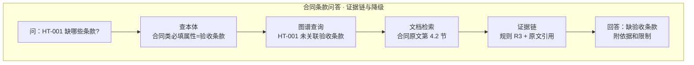
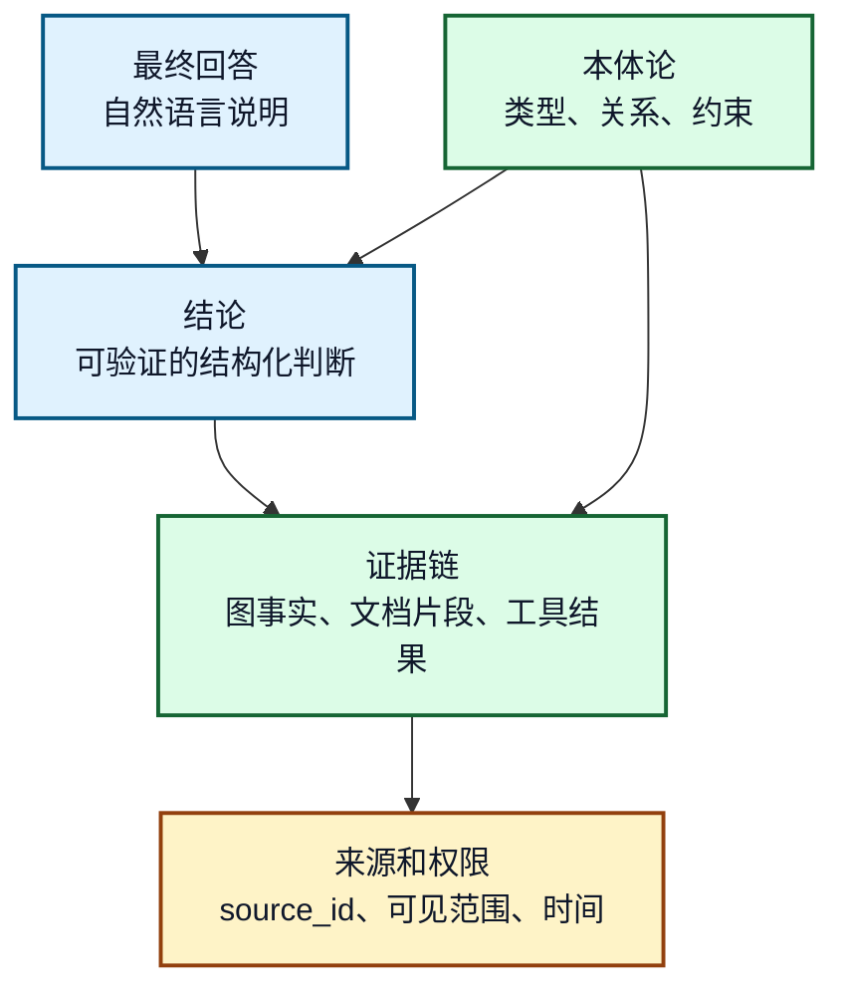
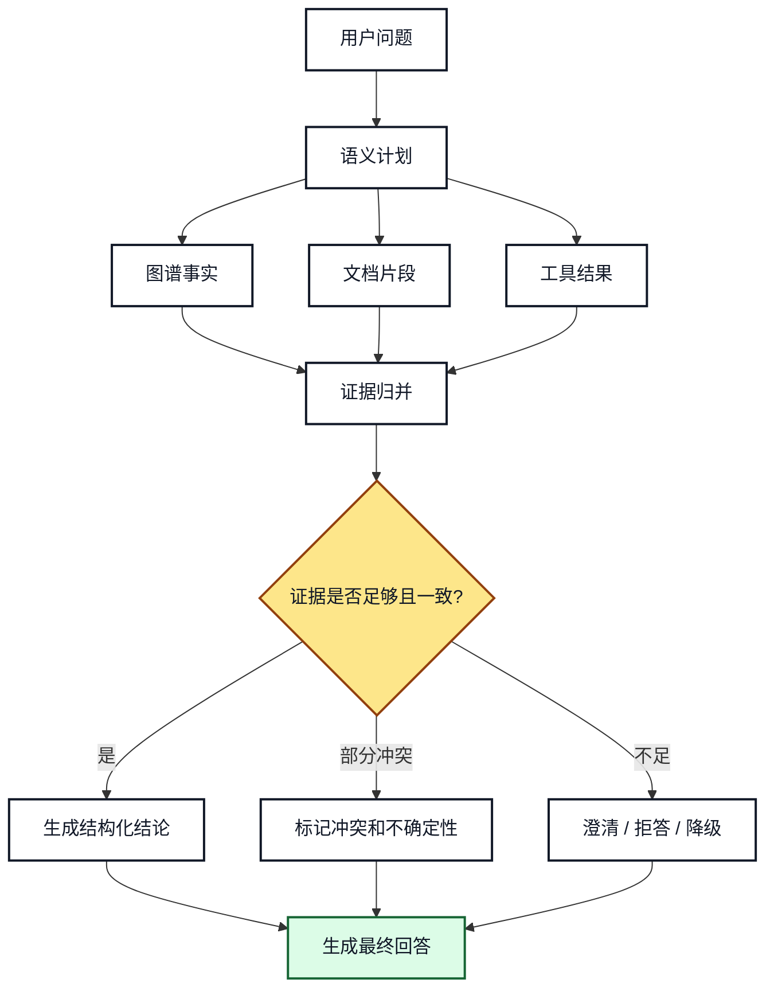
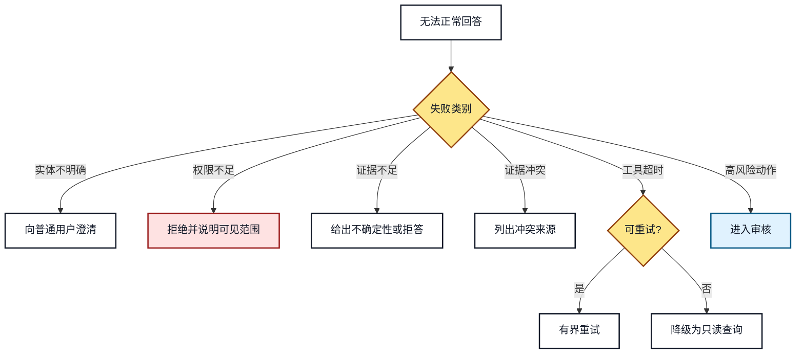

# 19. 可解释回答、证据链和失败降级

## 一分钟看懂本章

> **一句话**：回答"合同缺验收条款"不是一句话结论，而是给出"规则依据 + 文档引用 + 结构化结论"的证据链；证据不足、冲突、权限不足时按类别澄清、拒答或降级。



> **读图要点**：回答必须能从"结论"一路追溯到"规则/文档"；没有证据支撑的结论会被标记为不确定性或直接拒答，不能编造。

## 本章目标

- 区分事实、推理结论、文档证据和模型表述。
- 设计可追溯的证据链结构。
- 在证据不足、冲突、权限拒绝和工具失败时正确降级。
- 让 Agent 的回答能被普通用户理解，也能被审计人员追溯。

## 真实例子：回答"合同缺验收条款"时给出证据链

场景：Agent 回答《供货合同 HT-001》缺验收条款。普通用户要能看到依据，审计人员要能追溯来源。

**关键代码：回答对象携带证据链**

```python
answer = {
    "answer": "《供货合同 HT-001》缺少验收条款，建议补充后再签收。",
    "claims": [
        {
            "claim_id": "claim-001",
            "text": "HT-001 缺少验收条款",
            "type": "rule_derived",                  # 由规则 R3 推导
            "evidence_ids": ["rule:R3", "doc:HT-001#section-4.2"],
        },
        {
            "claim_id": "claim-002",
            "text": "金额 850 万已超预算上限 800 万",
            "type": "graph_fact",                    # 图谱事实
            "evidence_ids": ["kg:contract-ht001-budget"],
        },
    ],
    "uncertainty": "未执行自动修正，仅给出提示；采纳该风险需审核人批准",
}
```

**降级示例**：当合同 docx 无法解析（工具失败）时，不编造条款内容，而是降级为"暂时无法分析该合同，请确认文档格式"，并把 `tool_failed` 写进事件记录，供审计追溯。

## 1. 回答不只是自然语言

企业知识助手的回答至少由四层组成：



**图 19-1：回答、结论、证据和来源的层级**

> **读图要点**：从下往上读：来源（`doc:HT-001#section-4.2`、权限范围）→ 证据链（规则、图事实、文档片段）→ 结构化结论（claim-001"缺验收条款"）→ 自然语言回答。自然语言只是展示层，不是证据本身，必须能层层下钻回溯。

## 2. 证据链结构

```json
{
  "answer": "产品 A 的登录失败通常先检查身份服务配置。",
  "claims": [
    {
      "claim_id": "claim-001",
      "text": "登录失败影响登录功能",
      "type": "graph_fact",
      "evidence_ids": ["kg:fact-issue-feature"]
    },
    {
      "claim_id": "claim-002",
      "text": "推荐检查身份服务配置",
      "type": "document_supported",
      "evidence_ids": ["doc:login-guide#chunk-4"]
    }
  ],
  "uncertainty": "未执行自动修复，仅给出诊断建议"
}
```

建议保留 `claim_id`，因为一个回答可能包含多个结论，而每个结论的证据强度不同。

## 3. 回答生成流程



**图 19-2：从证据到回答的生成流程**

> **读图要点**：以"HT-001 缺验收条款"为例：语义计划命中"合同条款"意图→收集图谱事实（合同实例未关联验收条款）+ 文档片段（原文 4.2 节）→证据归并→判断"足够且一致"→生成结论 claim-001→输出回答。如果规则 R3 与原文冲突（原文其实有条款），则走"部分冲突"分支，列出冲突来源，而不是强行给唯一答案。

## 4. 失败降级决策树



**图 19-3：失败降级决策树**

> **读图要点**：以合同场景对照每个分支：用户说"那几份合同"（实体不明确）→先澄清是哪几份；普通用户查高风险采纳记录（权限不足）→拒绝并说明可见范围；合同文本乱码（证据不足）→说明不确定性而非编造；工具超时→有界重试一次，仍失败就降级为只读查询。不同失败不能用同一种兜底话术。

## 5. 冲突处理

| 冲突类型 | 示例 | 处理方式 |
|---|---|---|
| 图谱与文档冲突 | 图谱说模块 B，文档说模块 C | 标记冲突，列来源和更新时间 |
| 文档版本冲突 | 旧手册和新手册不一致 | 优先高版本和正式发布来源 |
| 工具结果与历史事实冲突 | 工具显示配置已变更，图谱仍是旧值 | 保留工具结果，创建待校验事实 |
| 权限过滤后证据不足 | 有证据但用户不可见 | 不泄露内容，只说明权限限制 |

## 6. 可解释回答模板

```text
结论：产品 A 的登录失败优先检查身份服务配置。
依据：
1. 图谱事实显示 product_a 属于 module_b，module_b 包含登录功能。
2. issue_d 影响登录功能，并关联 solution_e。
3. 登录处理手册第 4 段建议检查身份服务配置。
限制：当前未执行自动修复；高风险配置变更需要审核人批准。
下一步：可以先执行 dry_run 诊断。
```

回答可以简洁，但必须让用户知道哪些内容有证据，哪些内容是限制或下一步建议。

## 7. 常见错误和排查

- **只返回模型总结，不返回证据**：后续无法审计和纠错。
- **把不可见证据写进解释**：会造成权限泄露。
- **证据冲突时强行给唯一答案**：应暴露冲突来源和更新时间。
- **工具失败后仍给执行成功结论**：工具结果和建议必须分开表达。

## 8. 练习和自查

1. 为“产品 A 登录失败”构造包含 2 个图事实和 1 个文档片段的证据链。
2. 设计一个证据冲突时的用户可见回答。
3. 说明权限过滤后的证据不足如何表达，避免泄露不可见内容。

## 本章小结

可解释回答的核心是把自然语言答案拆回事实、证据、来源和限制。降级策略必须按失败类别处理，不能用一个通用兜底覆盖所有风险。

