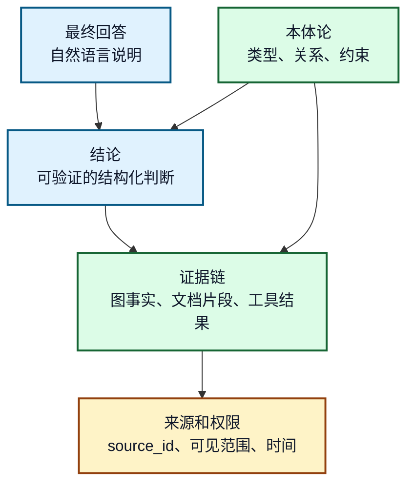
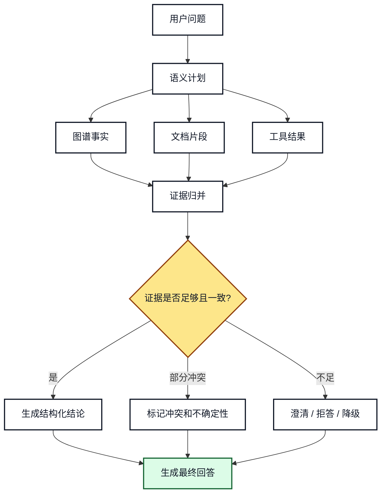
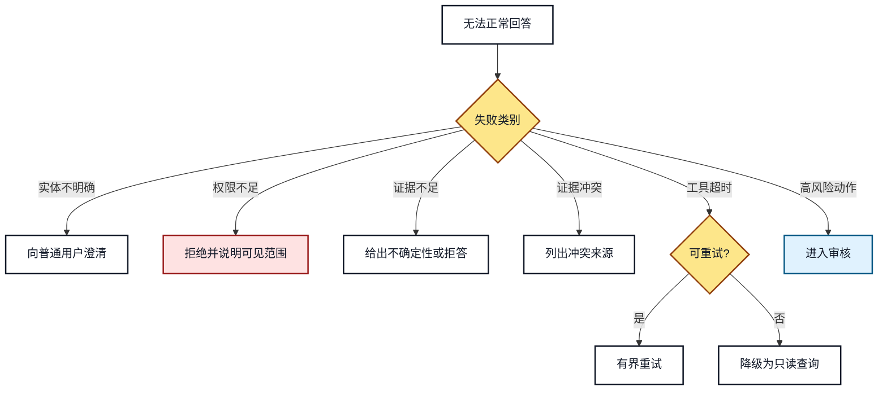

# 19. 可解释回答、证据链和失败降级

## 本章目标

- 区分事实、推理结论、文档证据和模型表述。
- 设计可追溯的证据链结构。
- 在证据不足、冲突、权限拒绝和工具失败时正确降级。
- 让 Agent 的回答能被普通用户理解，也能被审计人员追溯。

## 1. 回答不只是自然语言

企业知识助手的回答至少由四层组成：



**图 19-1：回答、结论、证据和来源的层级**

自然语言回答是展示层，不是证据本身。可解释系统必须能从回答追溯到结构化结论，再追溯到事实、文档和工具结果。

## 2. 证据链结构

```json
{
  "answer": "产品 A 的登录失败通常先检查身份服务配置。",
  "claims": [
    {
      "claim_id": "claim-001",
      "text": "登录失败影响登录功能",
      "type": "graph_fact",
      "evidence_ids": ["kg:fact-issue-feature"]
    },
    {
      "claim_id": "claim-002",
      "text": "推荐检查身份服务配置",
      "type": "document_supported",
      "evidence_ids": ["doc:login-guide#chunk-4"]
    }
  ],
  "uncertainty": "未执行自动修复，仅给出诊断建议"
}
```

建议保留 `claim_id`，因为一个回答可能包含多个结论，而每个结论的证据强度不同。

## 3. 回答生成流程



**图 19-2：从证据到回答的生成流程**

回答生成前要先归并证据，并明确哪些结论是事实支持的，哪些是推理得出的，哪些只是建议。

## 4. 失败降级决策树



**图 19-3：失败降级决策树**

不同失败不能用同一种兜底话术。权限不足不能靠重试解决，证据不足不能编造答案，实体不明确应优先澄清。

## 5. 冲突处理

| 冲突类型 | 示例 | 处理方式 |
|---|---|---|
| 图谱与文档冲突 | 图谱说模块 B，文档说模块 C | 标记冲突，列来源和更新时间 |
| 文档版本冲突 | 旧手册和新手册不一致 | 优先高版本和正式发布来源 |
| 工具结果与历史事实冲突 | 工具显示配置已变更，图谱仍是旧值 | 保留工具结果，创建待校验事实 |
| 权限过滤后证据不足 | 有证据但用户不可见 | 不泄露内容，只说明权限限制 |

## 6. 可解释回答模板

```text
结论：产品 A 的登录失败优先检查身份服务配置。
依据：
1. 图谱事实显示 product_a 属于 module_b，module_b 包含登录功能。
2. issue_d 影响登录功能，并关联 solution_e。
3. 登录处理手册第 4 段建议检查身份服务配置。
限制：当前未执行自动修复；高风险配置变更需要审核人批准。
下一步：可以先执行 dry_run 诊断。
```

回答可以简洁，但必须让用户知道哪些内容有证据，哪些内容是限制或下一步建议。

## 7. 常见错误和排查

- **只返回模型总结，不返回证据**：后续无法审计和纠错。
- **把不可见证据写进解释**：会造成权限泄露。
- **证据冲突时强行给唯一答案**：应暴露冲突来源和更新时间。
- **工具失败后仍给执行成功结论**：工具结果和建议必须分开表达。

## 8. 练习和自查

1. 为“产品 A 登录失败”构造包含 2 个图事实和 1 个文档片段的证据链。
2. 设计一个证据冲突时的用户可见回答。
3. 说明权限过滤后的证据不足如何表达，避免泄露不可见内容。

## 本章小结

可解释回答的核心是把自然语言答案拆回事实、证据、来源和限制。降级策略必须按失败类别处理，不能用一个通用兜底覆盖所有风险。

