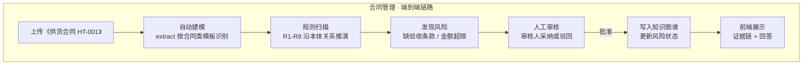
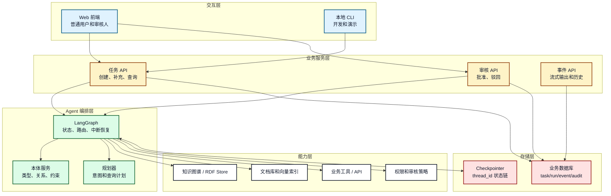
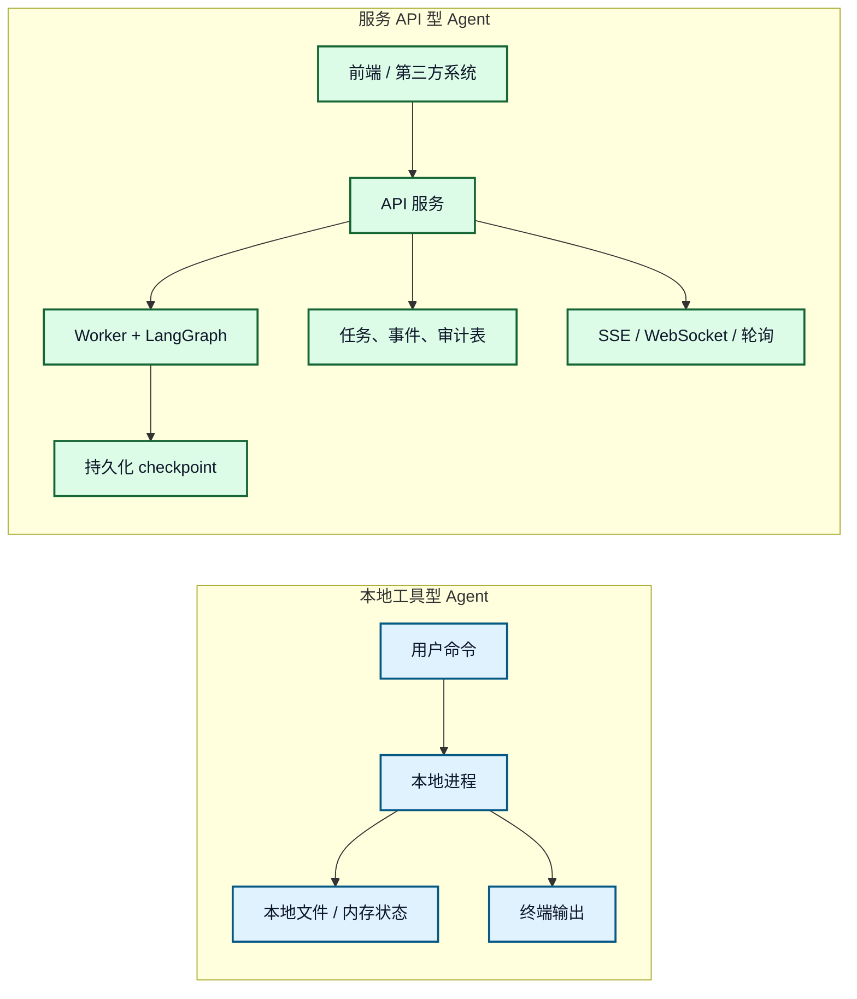
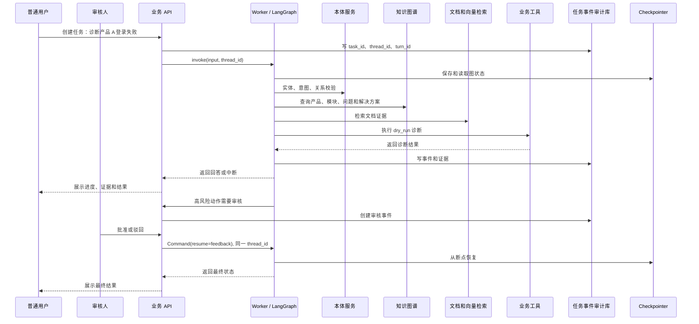

# 20. 完整项目：企业知识助手

## 一分钟看懂本章

> **一句话**：企业知识助手 = "上传合同→自动建模→规则扫描→风险采纳→人工审核→结果展示"的端到端闭环；最小版先本地跑通，生产版再加 API、队列、持久化。



> **读图要点**：链路每一步都依赖本体：建模用合同类模板，扫描用本体关系（合同→约束→项目），审核对象是具体的风险实例。图里只有"人工审核"是人工环节，其余全自动。

## 本章目标

- 把本体、知识图谱、文档检索、工具、HITL 和前端/API 串成完整项目。
- 对比本地工具型 Agent 和服务 API 型 Agent。
- 设计项目目录、核心接口、数据表和端到端时序。
- 明确哪些内容属于教程最小版，哪些属于生产增强版。

## 真实例子：最小可运行的合同管理链路

以「项目合同系统」为业务主线，把前面章节的能力串成一条端到端链路：

```text
用户上传合同 docx
  → 自动建模引擎 extract 按"合同类"模板识别 编号/金额/验收条款 → 生成合同实例
  → 规则引擎 R1-R8 沿"合同→约束→项目"关系推演 → 生成风险列表
  → 高风险（金额超限）进入人工审核
  → 审核人批准 → Agent 调用"采纳风险"工具 → 更新知识图谱 → 前端展示证据链
```

**关键代码：图状态与节点注册**

```python
from langgraph.graph import StateGraph
from typing import TypedDict, Optional

class EKState(TypedDict):
    task_id: str                     # task-contract-ht001
    contract_id: str                 # HT-001
    instances: list                  # 建模产物（合同实例）
    risks: list                      # 规则扫描结果
    approval: Optional[dict]         # 审核结果
    evidence: list                   # 证据链

g = StateGraph(EKState)
g.add_node("model_contract", model_contract)   # 自动建模
g.add_node("scan_rules", scan_rules)           # 规则扫描
g.add_node("human_review", human_review)       # interrupt 审核
g.add_node("accept_risk", accept_risk)         # 采纳风险，写图谱
g.add_edge("model_contract", "scan_rules")
g.add_edge("scan_rules", "human_review")
g.add_edge("human_review", "accept_risk")
app = g.compile(checkpointer=psql_checkpointer)  # 生产用持久化 checkpointer
```

教程最小版用内存 checkpointer 即可跑通；生产增强版替换为持久化 checkpointer，并加入任务表、事件流和审核入口。

## 1. 端到端总体架构



**图 20-1：企业知识助手端到端架构**

> **读图要点**：按自下而上的依赖关系读：存储层（业务库 task/event/audit + Checkpointer）→ 能力层（图谱、文档、工具、审核策略）→ 编排层（LangGraph + 本体服务 + 规划器）→ 服务层（任务/审核/事件 API）→ 交互层（Web/CLI）。关键原则是职责分离：业务库管任务与事件、checkpointer 管图状态、图谱管领域事实、文档库管非结构化证据，四者各司其职。

## 2. 本地工具型和服务 API 型对比



**图 20-2：本地工具型与服务 API 型**

> **读图要点**：左图适合个人验证"上传合同→扫描风险"的链路，状态在内存/文件里；右图是生产形态：前端/第三方 → API → Worker+LangGraph → 持久化 checkpoint 和任务表，并通过 SSE/WebSocket 推送事件。教程路径是先在左图跑通业务逻辑，再迁移到右图加用户隔离、审核入口和持久化。

## 3. 推荐目录结构

```text
enterprise_knowledge_agent/
├── app/
│   ├── api/              # task/review/event 接口
│   ├── graph.py          # LangGraph 编排
│   ├── state.py          # 图状态类型
│   ├── nodes/            # 本体、检索、工具、审核、回答节点
│   ├── ontology/         # 本体加载、实体链接、约束校验
│   ├── retrieval/        # 图检索、关键词、向量、证据合并
│   ├── tools/            # 业务工具封装
│   ├── policy/           # 权限、风险、审核策略
│   └── storage/          # task/run/event/audit/checkpoint 适配
├── data/
│   ├── ontology/
│   ├── instances/
│   ├── documents/
│   └── evaluation/
├── tests/
└── README.md
```

## 4. 端到端时序



**图 20-3：完整项目端到端时序**

> **读图要点**：按消息顺序读：创建任务（写 task/thread/turn）→ 图执行（建模→规则扫描→检索证据→dry_run 诊断）→ 高风险进入审核 → 审核人提交反馈 → `Command(resume=...)` 用同一 thread_id 恢复 → 返回最终结果。任何高风险动作都必须先形成审核材料，再由审核人反馈恢复执行，全程写事件与审计。

## 5. 核心数据表

| 表 | 关键字段 | 用途 |
|---|---|---|
| `tasks` | `task_id`, `user_id`, `thread_id`, `status` | 完整业务任务 |
| `runs` | `run_id`, `task_id`, `turn_id`, `status`, `started_at` | 单次输入或恢复执行 |
| `events` | `event_id`, `task_id`, `run_id`, `event_type`, `payload` | 前端事件和执行日志 |
| `approvals` | `approval_id`, `task_id`, `interrupt_id`, `decision` | HITL 审核 |
| `audit_logs` | `actor_id`, `action`, `resource_id`, `policy_version` | 合规审计 |
| `evidence` | `evidence_id`, `task_id`, `source_id`, `content_hash` | 回答证据链 |

## 6. 最小 API

```text
POST   /tasks                         创建任务
POST   /tasks/{task_id}/messages       普通用户补充信息
GET    /tasks/{task_id}                查询任务状态
GET    /tasks/{task_id}/events         查询事件流
POST   /tasks/{task_id}/approvals      审核人提交批准或驳回
GET    /tasks/{task_id}/answer         查询最终回答和证据链
```

前端只需要使用 `task_id`。`thread_id` 属于后端内部恢复键，不应暴露为可由前端任意指定的参数。

## 7. 项目验收标准

1. 支持用户多轮补充同一个任务。
2. 能用同一个 `thread_id` 恢复 LangGraph 中断。
3. 能通过本体查询产品、模块、问题和解决方案。
4. 能合并图谱事实和文档证据。
5. 能在高风险动作时进入审核流程。
6. 能输出最终回答、证据链和不确定性说明。
7. 能保存任务、运行、事件、审核和审计记录。

## 本章小结

完整项目不是把所有能力塞进一个 Agent 函数，而是用业务 API、LangGraph、本体服务、检索、工具、权限和存储共同形成闭环。最小版先跑通端到端链路，生产版再增强持久化、并发、监控和权限。

