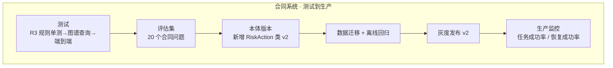
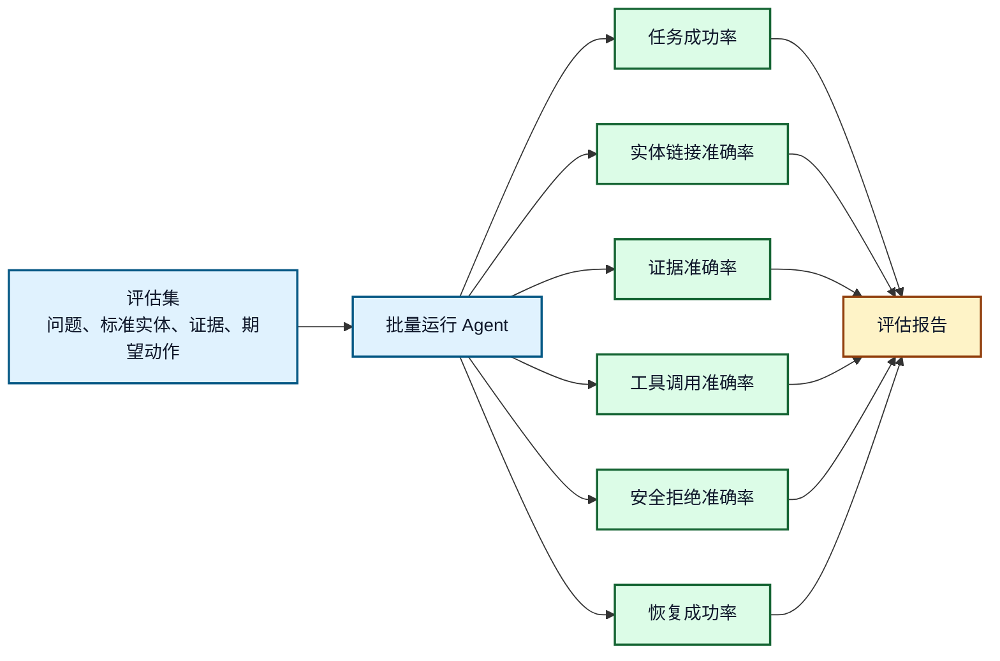
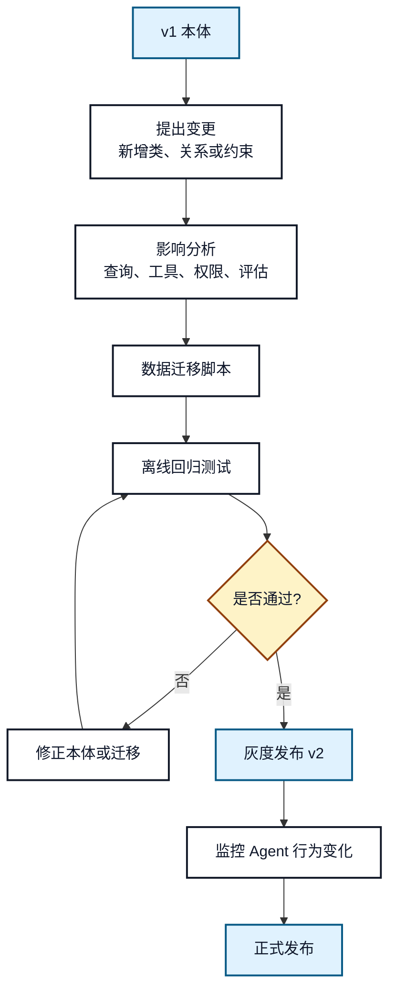
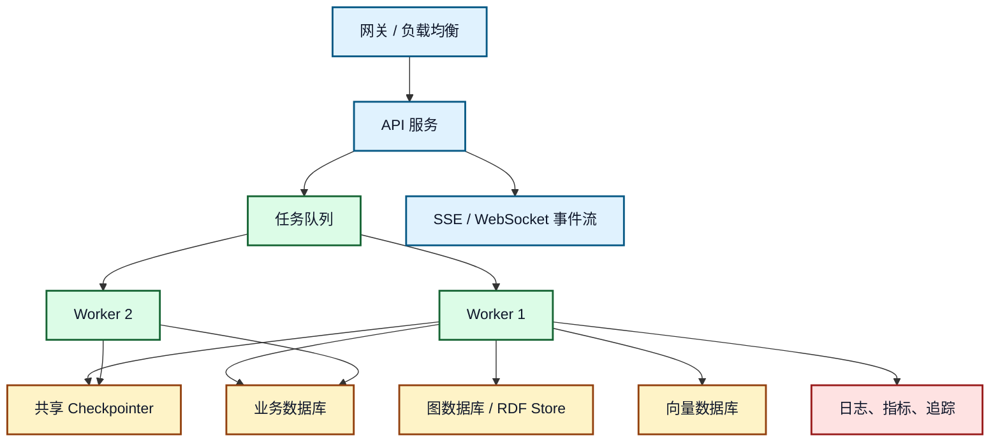

# 21. 测试、评估、版本演进和生产化

## 一分钟看懂本章

> **一句话**：上线"合同风险扫描"前，先建测试金字塔和评估集；本体升级要走"迁移→回归→灰度"流程；生产环境必须有持久化状态、并发控制和可观测性。



> **读图要点**：测试→评估→版本→灰度→监控是一条完整闭环；任何环节失败都回退到上一环节，不允许直接改线上本体。

## 本章目标

- 设计本体、数据、检索、工具、工作流和回答的测试体系。
- 评估 Agent 的任务成功率、证据准确率和安全性。
- 管理本体版本、查询模板、数据迁移和 Agent 行为变化。
- 将教程项目演进为可上线的生产系统。

## 真实例子：合同风险扫描功能的测试与上线

以"新增规则 R9：付款条款缺失 → 中风险"为例，走完整流程：

1. **单元测试**：给 R9 输入"付款条款为空"的合同实例，断言输出 `{level: "中", missing: "付款条款"}`。
2. **评估集**：在 20 条合同问题里加入 3 条"缺付款条款"用例，验证回答能给出证据链。
3. **本体版本**：`Contract` 类新增必填属性 `payment_clause`，本体 `v1 → v2`。
4. **迁移**：对存量 300 份合同跑数据迁移脚本，标记缺失项；离线回归 R1-R8 全部通过。
5. **灰度**：先让 10% 流量使用 v2，监控"规则误报率"无异常后全量发布。

**关键代码：评估报告与版本记录**

```python
report = {
    "task_success_rate": 0.95,     # 任务成功率
    "evidence_accuracy": 0.92,     # 证据准确率
    "safe_reject_rate": 0.98,      # 安全拒绝准确率
    "ontology_version": "v2",      # 回答/审计中保存版本，便于回溯
    "eval_set_version": "2026-08",
}
```

## 1. 测试金字塔

```mermaid
flowchart TB
    E2E[端到端业务测试<br/>完整任务、HITL、恢复]
    G[图级集成测试<br/>节点路由、状态迁移、失败路径]
    C[组件测试<br/>本体查询、检索、工具、权限]
    U[单元测试<br/>实体链接、校验函数、证据排序]
    U --> C
    C --> G
    G --> E2E

    classDef unit fill:#DCFCE7,stroke:#166534,color:#0F172A,stroke-width:2px;
    classDef comp fill:#E0F2FE,stroke:#075985,color:#0F172A,stroke-width:2px;
    classDef graph fill:#FEF3C7,stroke:#92400E,color:#0F172A,stroke-width:2px;
    classDef e2e fill:#FEE2E2,stroke:#991B1B,color:#0F172A,stroke-width:2px;
    class U unit;
    class C comp;
    class G graph;
    class E2E e2e;
```

**图 21-1：本体增强 Agent 测试金字塔**

> **读图要点**：底层单元测试（实体链接、R3/R9 规则函数、证据排序）数量最多、最快；往上组件测试（本体查询、混合检索、工具权限）、图级测试（节点路由、中断恢复）、端到端测试（上传 HT-001→扫描→审核→采纳）逐层变慢。越底层越确定，越上层越接近真实业务；不要只做端到端评测，否则很难定位失败来自本体、检索、工具还是工作流。

## 2. 测试清单

| 层级 | 测试对象 | 核心断言 |
|---|---|---|
| 本体结构 | 类、关系、约束 | 必需类存在、关系方向正确、互斥和基数合理 |
| 实例数据 | RDF/图谱事实 | 类型合法、来源可追溯、无明显冲突 |
| SPARQL/图查询 | 查询模板 | 输入输出类型正确、空结果可解释 |
| 混合检索 | 图、关键词、向量合并 | 证据召回率、权限过滤、去重排序 |
| 工具调用 | 参数和权限 | 类型错误拒绝、高风险进入审核 |
| 工作流 | 状态迁移 | 中断、恢复、重试、驳回路径正确 |
| 回答生成 | 结论和证据 | 答案有依据、不泄露不可见证据 |

## 3. 评估指标



**图 21-2：评估链路**

> **读图要点**：从左侧评估集出发，批量运行 Agent，产出六项指标（任务成功率、实体链接准确率、证据准确率、工具调用准确率、安全拒绝准确率、恢复成功率），最终汇入评估报告。评估集不能只包含"能回答"的问题，还应包含实体歧义（"那几份合同"）、证据冲突（规则与原文不一致）、权限不足（查不可见记录）、工具失败（docx 解析超时）和高风险审核场景。

## 4. 本体版本演进

本体一变，受影响的不只是图谱数据，还包括查询模板、工具参数、权限策略、Prompt、评估集和前端展示。



**图 21-3：本体版本发布流程**

> **读图要点**：从 `v1 本体` 出发：提出变更（如给 `Contract` 类加 `payment_clause` 属性）→ 影响分析（查询模板、工具参数、权限策略、评估集）→ 写数据迁移脚本 → 离线回归测试 → 不通过则修正后重测 → 通过则灰度发布 v2 → 监控 Agent 行为变化 → 正式发布。本体版本要和数据版本、查询模板版本、策略版本一起记录，回答和审计记录中也应保存当时使用的版本，便于问题回溯。

## 5. 生产部署关注点



**图 21-4：生产部署架构**

> **读图要点**：入口（网关→API 服务→SSE/WebSocket 事件流）与 Worker 可以横向扩展；关键约束是所有 Worker 必须共享同一个持久化 Checkpointer、业务库、图数据库和向量库。生产环境不应依赖单进程内存状态，否则服务重启或多实例并发会丢失图状态。

## 6. 生产化清单

| 主题 | 最低要求 |
|---|---|
| 状态持久化 | 共享 checkpointer，服务重启后可恢复 |
| 并发控制 | 同一 `thread_id` 串行写入，重复请求幂等 |
| 权限安全 | 服务端强制鉴权，前端不能指定任意 `thread_id` |
| HITL | 审核材料、审核人、决策和恢复都有审计 |
| 事件流 | 前端能看到 running、interrupted、completed、failed |
| 可观测性 | 记录节点耗时、工具失败、模型成本、重试次数 |
| 版本管理 | 本体、Prompt、查询模板、策略和评估集有版本 |
| 回滚 | 可回滚本体版本、关闭高风险工具、降级为只读问答 |

## 7. 常见错误和排查

- **只评估最终回答**：无法发现实体链接、证据召回和权限拒绝的问题。
- **本体修改没有回归测试**：可能导致查询模板和工具参数失效。
- **内存 checkpointer 上生产**：重启或多实例会丢状态。
- **没有同线程并发控制**：两次恢复可能同时写同一条状态链。
- **缺少版本记录**：无法解释为什么同一问题前后回答不同。

## 8. 最终验收任务

1. 构造 20 个企业知识助手评估问题，覆盖正常、歧义、冲突、权限和审核场景。
2. 为本体新增一个 `RiskAction` 类，并完成迁移和回归测试。
3. 模拟工具超时、审核驳回和服务重启后的恢复。
4. 输出一份包含任务成功率、证据准确率和安全拒绝准确率的评估报告。

## 本章小结

生产化的关键不是让 Agent “更聪明”，而是让语义、数据、工具、工作流、权限、评估和版本演进都可验证、可恢复、可审计。完成这些闭环后，本体论增强 Agent 才具备稳定落地的基础。

