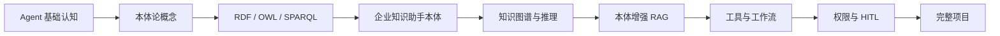

# 本体论 + Agent

这是“本体论 + Agent”学习教程的工作目录。

## 学习主线



## 当前进度

- [x] 教程方案
- [x] 第一阶段章节骨架
- [x] 最小 RDF 示例
- [x] RDF/OWL/SPARQL 实战章节
- [x] 企业知识助手本体
- [x] 本体增强 Agent 集成章节 11-16
- [x] LangGraph 工程化章节 17-19
- [x] 完整项目章节 20-21

## 目录

```text
本体论-agent/
├── 本体论+Agent学习教程方案.md
├── 01-概念基础/
├── 02-RDF-OWL-SPARQL/
├── 03-本体建模/
├── 04-知识图谱与推理/
├── 05-Agent集成/
├── 06-LangGraph工程化/
├── 07-完整项目/
├── code/01_rdf_owl/
├── code/02_sparql/
├── code/03_ontology_modeling/
├── code/04_reasoning/
├── code/05_agent_integration/
├── code/06_langgraph_project/
└── data/
```

推荐先阅读：

1. `01-概念基础/01.为什么Agent需要本体论.md`
2. `01-概念基础/02.本体论知识图谱RAG和记忆.md`
3. `01-概念基础/03.本体论在Agent架构中的位置.md`
4. `01-概念基础/04.类实例属性关系和约束.md`
5. `code/01_rdf_owl/minimal_rdf.py`
6. `05-Agent集成/11.本体论增强上下文管理和记忆.md`
7. `05-Agent集成/12.本体论增强RAG.md`
8. `06-LangGraph工程化/17.多轮对话中的实体关系和状态管理.md`
9. `06-LangGraph工程化/18.使用LangGraph编排本体查询Agent工具和HITL.md`
10. `07-完整项目/20.完整项目企业知识助手.md`
