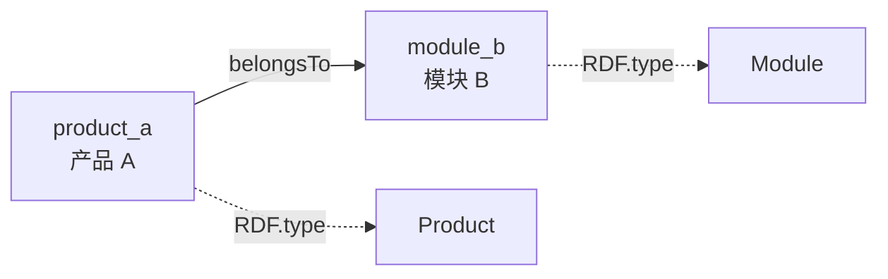

# 最小 RDF 示例

## 安装依赖

```bash
python -m pip install -r requirements.txt
```

## 运行

```bash
python minimal_rdf.py
```

预期输出：

```text
产品 A 属于 模块 B
```

## 示例对应关系


```mermaid
flowchart LR
    P[product_a<br/>产品 A] -->|belongsTo| M[module_b<br/>模块 B]
    P -.->|RDF.type| PC[Product]
    M -.->|RDF.type| MC[Module]
```
