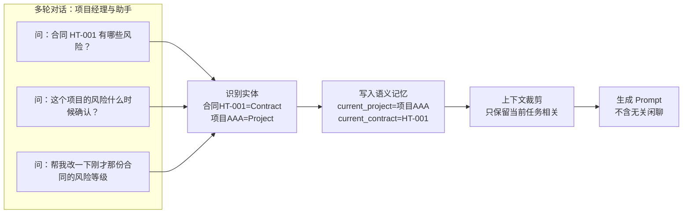
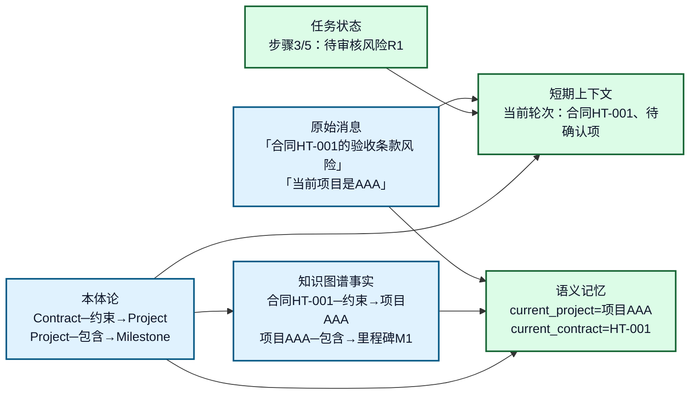
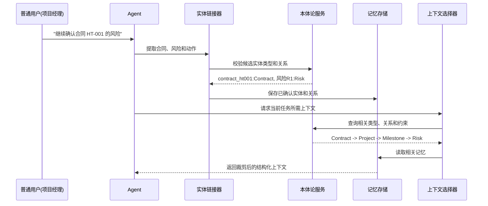
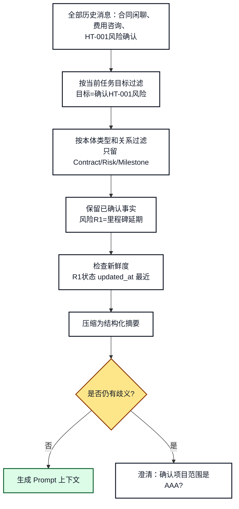

# 11. 本体论增强上下文管理和记忆

## 一分钟看懂本章

> **一句话**：上下文和记忆不是"把聊天记录全塞进提示词"，而是用本体把多轮对话里的业务对象（合同 HT-001、项目 AAA、风险 R1）沉淀成结构化记忆，按语义裁剪后只把"当前任务真正需要"的部分交给大模型。



**读图要点**：三句话都没有把"合同/项目"写全，但本体把"刚才那份合同"归一化为 `HT-001`、"这个项目"归一化为 `项目AAA`；多轮对话靠这份语义记忆才能持续"讲清楚"。

## 本章目标

- 区分对话上下文、任务状态、长期记忆和知识图谱事实。
- 使用本体类型、关系和约束筛选真正相关的上下文。
- 将用户消息中的实体和关系沉淀为可检索的记忆。
- 避免把全部历史消息直接拼接到 Prompt。

## 1. 为什么需要语义化上下文

上下文窗口不是记忆系统。把所有历史消息都放入 Prompt，会产生三个问题：

1. 无关消息占用上下文窗口。
2. 同一个对象出现多个名称，模型无法稳定判断是否为同一实体。
3. 历史中的旧状态可能覆盖当前状态。

本体论提供统一的概念和关系，使上下文可以按语义筛选，而不只是按时间截断。

## 1.1 真实例子：在项目合同系统里"记住当前项目"

项目经理与助手连续对话：

```text
用户：合同 HT-001 有哪些风险？
助手：查到 3 条，其中 R1 是"里程碑延期"风险，需要项目经理确认。
用户：这个项目还有别的风险吗？      <- "这个项目"指哪个？
用户：刚才那份合同的风险等级能改吗？ <- "刚才那份合同"又是哪份？
```

没有本体时，模型只能靠猜；有本体后，Agent 每轮把实体沉淀成记忆：

```python
def extract_and_link(message: str, memory: MemoryStore) -> SemanticMemory:
    candidates = entity_linker.candidates(message)      # {"这个项目": Candidate(Project), "HT-001": Candidate(Contract)}
    confirmed = ontology.validate(candidates)           # 用本体校验类型和关系
    memory.upsert(confirmed)                            # current_project=项目AAA, current_contract=HT-001
    return memory.filter(scope="current_task")          # 只取当前任务相关的记忆
```

关键点：**只有通过本体类型校验的候选才能升级为记忆；未确认的只能放在临时上下文**。

## 2. 四种数据边界



**图 11-1：上下文、记忆、知识和本体论的边界**

**读图要点**：从左往右读——原始消息（"合同HT-001的验收条款风险"）和知识图谱事实（合同HT-001─约束→项目AAA）都要经过本体论解释，才分别进入短期上下文和语义记忆；任务状态（步骤3/5：待审核风险R1）是运行时状态，不应直接当作长期知识写入。图中每个节点都换成了合同业务里的具体对象，而不是抽象的"消息/事实"。

| 数据 | 生命周期 | 典型内容 | 是否直接放入 Prompt |
|---|---|---|---|
| 短期上下文 | 当前执行或最近几轮 | 最近问题、当前实体（合同HT-001） | 经过裁剪后放入 |
| 任务状态 | 一个 `task_id` 生命周期 | 当前步骤、待审核动作（风险R1） | 放入结构化摘要 |
| 语义记忆 | 跨任务 | 当前项目=项目AAA、当前合同=HT-001 | 按需召回 |
| 知识图谱事实 | 领域长期知识 | 合同HT-001─约束→项目AAA | 按查询结果召回 |
| 原始消息 | 审计和回溯 | 完整对话文本 | 通常不全部放入 |

## 3. 从消息到语义记忆



**图 11-2：消息转化为语义记忆的时序**

**读图要点**：从上往下看——用户说"继续确认合同 HT-001 的风险"，Agent 不是直接记，而是先提取实体、再让本体校验"HT-001 确实是 Contract、风险 R1 确实是 Risk"，校验通过才写入记忆。**校验必须先于写入**；未确认的候选实体只能放入临时上下文，不能升级为长期事实。

推荐的记忆记录至少包含：

```json
{
  "subject": "contract_ht001",
  "predicate": "ex:hasCurrentRisk",
  "object": "risk_r1",
  "subject_type": "Contract",
  "object_type": "Risk",
  "status": "confirmed",
  "source": "conversation",
  "task_id": "task-001",
  "confidence": 0.96,
  "updated_at": "2026-08-23T10:00:00+08:00"
}
```

## 4. 语义化上下文裁剪



**图 11-3：上下文裁剪流程**

**读图要点**：沿箭头从上往下——先按任务目标过滤（"合同闲聊""费用咨询"直接丢掉），再按本体关系过滤（只留 Contract/Risk/Milestone 三类实体），最后检查新鲜度；只有到这一步仍有歧义才澄清。这样能保留"风险R1影响里程碑M1"这类关键关系，同时把 10 轮对话压成一段摘要。

一个适合交给模型的上下文摘要可以是：

```text
当前任务：确认合同 HT-001 的风险
已确认实体：合同HT-001(Contract)、项目AAA(Project)、里程碑M1(Milestone)
相关事实：合同HT-001 约束 项目AAA；项目AAA 包含 里程碑M1；风险R1 影响 里程碑M1
已知约束：确认风险需要 project_manager 角色；高风险修复需要审核
待确认：风险R1 是否标记为已确认
```

## 5. 企业知识助手中的记忆策略

| 记忆类型 | 示例 | 写入条件 | 失效方式 |
|---|---|---|---|
| 当前轮次 | 用户刚提到"风险等级" | 每轮产生 | 轮次结束或被覆盖 |
| 任务记忆 | 已选择合同HT-001、已完成实体确认 | 任务状态发生变化 | 任务完成或取消 |
| 用户偏好 | 用户偏好中文回答 | 用户明确表达或多次确认 | 用户修改 |
| 领域事实 | 合同HT-001 约束 项目AAA | 来源可信且通过校验 | 知识版本更新 |
| 审计记录 | 谁在何时确认了风险R1 | 每次关键事件 | 按合规策略归档 |

关键原则是：**事实写入知识层，任务状态写入任务存储，用户偏好写入用户记忆，原始消息写入审计层。**

## 6. 常见错误和排查

### 错误一：把本体论当作历史消息存储

本体论定义“什么概念和关系存在”，不负责保存每次对话。应将本体文件、实例事实和对话状态分开存储。

### 错误二：未经确认就写入长期记忆

模型的实体识别结果可能是候选结果。建议使用 `candidate -> confirmed -> rejected` 状态机。

### 错误三：只按最近消息裁剪

最近消息不一定最相关。当前任务需要的实体关系、权限状态和待审核动作，即使出现在较早消息中，也应该通过语义索引召回。

## 7. 练习和自查

1. 把一段 10 轮对话拆成短期上下文、任务状态、长期记忆和领域事实。
2. 为“这个模块可以执行发布吗？”设计实体链接和澄清策略。
3. 检查记忆记录是否包含类型、来源、置信度和更新时间。

## 本章小结

本体论让上下文管理从“按字符截断”升级为“按任务和语义裁剪”。它不替代记忆存储，而是为记忆写入、查询和冲突处理提供统一语义。

