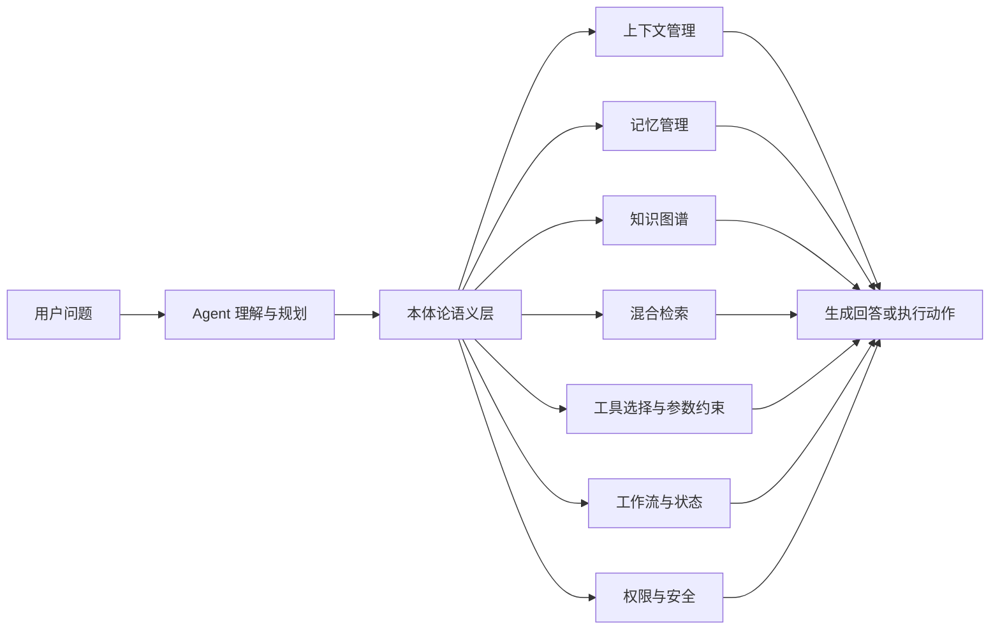
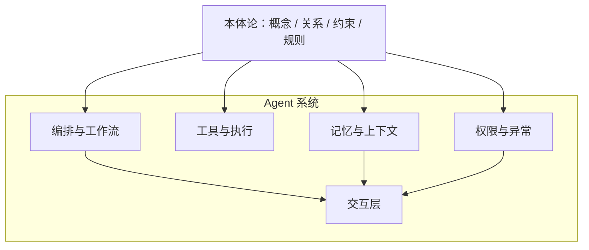
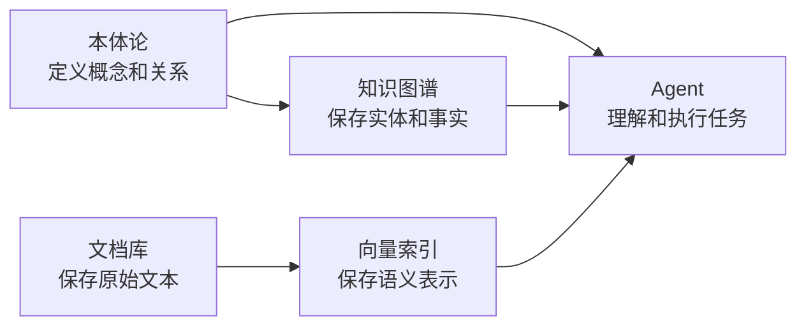
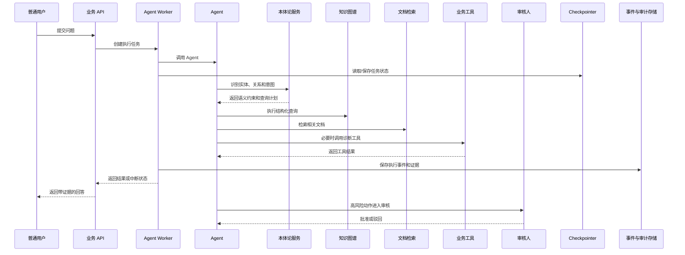
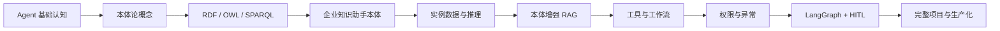

# 本体论 + Agent 学习教程方案

## 1. 教程定位

本教程面向两类读者：

- **本体论初学者**：从概念、RDF、RDFS、OWL、SPARQL、推理开始学习。
- **Agent 开发者**：理解本体论如何增强上下文管理、记忆、RAG、工作流、工具、权限和异常处理。

教程最终目标不是只会画本体类图，也不是只会查询知识图谱，而是完成一个“本体论增强的企业知识助手”。



这张图是全教程的总纲：本体论不是 Agent 的某一个孤立模块，而是连接多个 Agent 能力的**语义基础层**。

## 2. 核心认知

### 2.1 本体论属于 Agent 的哪一层

建议把 Agent 拆成以下几层：

```text
交互层：用户输入、对话、审批、结果展示
编排层：Agent Loop、LangGraph、任务状态、重试和恢复
执行层：工具、API、数据库、检索器、业务系统
记忆层：短期状态、长期记忆、知识库、历史记录
语义层：本体论、概念、关系、约束、规则和领域词汇
基础设施层：模型、数据库、消息队列、日志、权限系统
```

本体论位于语义层，横向影响其他层：



### 2.2 本体论、知识图谱、记忆和 RAG 的区别



| 对象 | 解决的问题 | 示例 |
|---|---|---|
| 本体论 | 概念、关系和约束如何定义 | 产品属于模块，问题影响功能 |
| 知识图谱 | 具体事实如何保存 | 产品 A 属于模块 B |
| 记忆 | Agent 如何保存上下文和历史 | 用户偏好、已确认条件 |
| RAG | 如何从文档中召回相关内容 | 检索故障手册片段 |
| Agent | 如何理解目标并完成任务 | 查询事实、调用工具、生成答案 |

## 3. 贯穿案例：企业知识助手

教程使用“企业知识助手”作为贯穿案例，不绑定具体行业，但覆盖典型的本体建模和 Agent 工程问题。

### 3.1 核心领域对象

```text
产品、模块、功能、问题、解决方案、文档、角色、流程、权限、风险、任务
```

### 3.2 典型用户问题

```text
“产品 A 的登录失败问题有哪些解决方案？”
“哪些文档说明了模块 B 的权限配置？”
“这个高风险操作需要谁审核？”
“根据问题描述，应该调用哪个诊断工具？”
```

### 3.3 端到端链路



## 4. 学习目标

完成教程后，读者应能：

1. 解释本体论在 Agent 架构中的位置。
2. 区分本体论、知识图谱、RAG、数据库和记忆。
3. 从业务问题抽取类、实例、属性、关系和约束。
4. 使用 RDF/OWL 表达最小领域模型。
5. 使用 SPARQL 完成结构化查询和多跳关系查询。
6. 理解规则推理和一致性校验。
7. 使用本体论增强实体识别、上下文管理和混合检索。
8. 使用本体论约束工具选择、参数校验和权限判断。
9. 使用 LangGraph 编排本体查询、Agent、工具和 HITL。
10. 完成企业知识助手的测试、评估和生产化设计。

## 5. 教程章节路线

### 第一阶段：建立概念基础

#### 第 1 章：为什么 Agent 需要本体论

- Agent 只靠自然语言和向量检索时的边界。
- 概念、关系、约束对 Agent 决策的价值。
- 本体论作为语义基础层的定位。

配图：

1. 传统 LLM Agent 与本体论增强 Agent 对比图。
2. 本体论连接 Agent 六类能力的总体架构图。

练习：比较“搜索相关文档”和“理解产品属于哪个模块”两类问题。

#### 第 2 章：本体论、知识图谱、RAG、数据库和记忆

- 本体论与知识图谱的区别。
- 结构化事实和非结构化文档的区别。
- 向量检索、图查询和关系数据库的适用边界。
- 为什么生产 Agent 通常需要混合检索。

配图：

1. 五种技术的职责对比图。
2. 文档、向量、图谱和 Agent 的数据流图。
3. 结构化查询与语义检索的对比图。

#### 第 3 章：Agent 架构中的本体论位置

- 上下文管理、记忆、工作流、异常、权限和工具的职责。
- 本体论如何横向支撑这些能力。
- 本体论不是记忆，也不是规则引擎本身。

配图：

1. Agent 分层架构图。
2. 本体论与六类能力的关系图。
3. “本体论 / 知识 / Agent 行为”三层对比图。

#### 第 4 章：类、实例、属性、关系和约束

- Class、Individual、Data Property、Object Property。
- 继承、组合、反向关系和多跳关系。
- 基数、类型、必填字段和业务约束。

配图：

1. 类和实例关系图。
2. 企业知识助手的最小类层级图。
3. 属性、关系和约束标注图。

### 第二阶段：掌握本体技术

#### 第 5 章：RDF、RDFS、OWL 和 SPARQL 基础

- RDF 三元组。
- RDFS 类层级和属性层级。
- OWL 的限制、等价、互斥和关系特征。
- SPARQL 查询结构。

配图：

1. RDF 三元组图。
2. RDF 到知识图谱的转换图。
3. RDFS/OWL 语义层级图。
4. SPARQL 查询执行流程图。

#### 第 6 章：从业务问题抽取本体概念

- 从用户问题、流程文档和数据表抽取候选概念。
- 区分实体、事件、角色、状态和动作。
- 识别同义词、上下位词和歧义词。
- 设计本体范围，避免一开始建模过度。

配图：

1. 业务文本到本体概念的抽取流程图。
2. 候选词分类决策树。
3. 领域边界和非目标范围图。

#### 第 7 章：设计企业知识助手本体

- 产品、模块、功能、问题、解决方案和文档建模。
- 角色、流程、权限和风险建模。
- 设计实体关系和查询路径。
- 设计最小可用本体和后续扩展点。

配图：

1. 企业知识助手类图。
2. 核心关系图。
3. 问题到解决方案的多跳路径图。
4. 本体版本演进图。

#### 第 8 章：创建实例数据和知识图谱

- 从 JSON/CSV/数据库记录生成实例。
- 实体 ID、来源、时间和置信度。
- 文档事实与结构化事实的关联。
- 数据导入和增量更新。

配图：

1. 业务数据到知识图谱的数据流图。
2. 实体、事实和证据来源关系图。
3. 增量更新时序图。

#### 第 9 章：使用 SPARQL 进行结构化查询

- 单跳查询、多跳查询和聚合查询。
- 按类型、关系、权限和状态过滤。
- 查询结果如何交给 Agent。
- 查询失败、空结果和歧义处理。

配图：

1. 用户问题到 SPARQL 的转换流程图。
2. 多跳查询路径图。
3. 查询结果到 Agent 上下文的转换图。

#### 第 10 章：规则推理、一致性校验和本体演进

- 显式事实和推导事实。
- 类型推理、关系传递和规则推导。
- 冲突、缺失、循环和非法关系。
- 本体版本、数据迁移和兼容策略。

配图：

1. 推理前后事实变化图。
2. 一致性校验决策树。
3. 规则执行流程图。
4. 本体版本演进图。

### 第三阶段：接入 Agent

#### 第 11 章：本体论增强上下文管理和记忆

- 短期上下文、长期记忆和知识事实的区别。
- 使用本体类型筛选相关上下文。
- 记忆中的实体归一化和关系更新。
- 避免把所有历史消息都塞进 Prompt。

配图：

1. 上下文分层图。
2. 消息到实体和关系记忆的转换图。
3. 上下文裁剪流程图。

#### 第 12 章：本体论增强 RAG

- 实体识别和实体链接。
- 基于关系扩展检索范围。
- 图检索、关键词检索和向量检索的组合。
- 证据合并、冲突处理和来源排序。

配图：

1. 本体论增强 RAG 总体链路图。
2. 混合检索分支图。
3. 实体扩展和多跳召回图。
4. 证据合并和排序图。

#### 第 13 章：本体论驱动的意图识别和查询规划

- 用户意图、实体、关系和动作识别。
- 从自然语言生成结构化查询计划。
- 查询计划的类型校验和安全限制。
- 无法确定意图时的澄清问题。

配图：

1. 用户问题到意图结构的转换图。
2. 查询规划决策图。
3. 澄清问题状态机。

#### 第 14 章：本体论驱动工具选择和参数校验

- 工具能力的语义描述。
- 工具输入参数、输出类型和前置条件。
- 根据实体类型和关系匹配工具。
- 工具执行前的权限和风险校验。

配图：

1. 工具能力本体图。
2. 工具选择时序图。
3. 参数类型和约束校验流程图。
4. 工具结果回写知识图谱的流程图。

#### 第 15 章：本体论与工作流

- 任务、角色、状态、前置条件和后置条件。
- 本体论如何帮助 Agent 选择下一步节点。
- 可恢复工作流和状态持久化。
- 业务流程与 Agent 自主规划的边界。

配图：

1. 本体论驱动工作流状态机。
2. 任务状态和前置条件关系图。
3. 正常、失败和恢复路径图。

#### 第 16 章：本体论与权限、安全边界和异常处理

- 角色、资源、动作和权限关系。
- 高风险动作识别。
- 类型错误、事实冲突、权限拒绝和工具失败。
- 重试、降级、人工接管和审计。

配图：

1. 角色-资源-动作权限关系图。
2. 权限判断决策树。
3. 异常分类和处理流程图。
4. 失败降级与人工接管图。

### 第四阶段：完成工程闭环

#### 第 17 章：多轮对话中的实体、关系和状态

- 普通用户、审核人和 Agent 的角色边界。
- 多轮消息中的实体指代和状态延续。
- `user_id`、`task_id`、`thread_id`、`turn_id/run_id` 的组织。
- 一个完整任务多轮执行时的并发和幂等。

配图：

1. 多轮会话状态图。
2. ID 关系图。
3. 普通用户和审核人的角色时序图。
4. 多轮输入与状态链关系图。

#### 第 18 章：用 LangGraph 编排本体查询、Agent、工具和 HITL

- State、Node、Edge 和 Checkpointer。
- 本体查询节点、检索节点、工具节点和审核节点。
- `interrupt()`、`Interrupt`、`Command(resume=...)` 的区别。
- 流式输出、恢复执行和异常路径。

配图：

1. LangGraph 总体架构图。
2. 本体查询到工具执行的节点流程图。
3. HITL 中断恢复时序图。
4. 图状态和 checkpoint 数据流图。

#### 第 19 章：可解释回答、证据链和失败降级

- 回答中的事实、推理结论和不确定性。
- 结构化事实和文档证据的关联。
- 证据不足时如何澄清、拒答或降级。
- 可观测性和审计记录。

配图：

1. 证据链结构图。
2. Agent 回答生成流程图。
3. 失败降级决策树。

#### 第 20 章：完整项目：企业知识助手

- 项目目标和用户角色。
- 本体、知识图谱、文档库、向量索引和 Agent 服务。
- 查询、工具调用、审核和结果展示。
- 本地工具型和 API 服务型两种运行模式。

配图：

1. 端到端总体架构图。
2. 本地工具型 Agent 架构图。
3. API 服务型 Agent 架构图。
4. 端到端用户请求时序图。

#### 第 21 章：测试、评估、版本演进和生产化

- 本体结构测试、数据质量测试和查询测试。
- Agent 任务成功率、证据准确率和工具调用准确率。
- 本体版本兼容和知识更新。
- 缓存、队列、并发、权限、监控和部署。

配图：

1. 测试金字塔和评估链路图。
2. 本体版本发布流程图。
3. 生产部署架构图。
4. 运行监控和故障处理图。

## 6. 每章统一写作模板

每章按以下顺序编写：

1. 本章目标。
2. 问题背景。
3. 核心概念。
4. 关键图示。
5. 最小数据或代码示例。
6. 企业知识助手案例改造。
7. 常见错误和排查方式。
8. 练习任务和自查清单。
9. 本章小结。

每张图必须有标题，并在图后解释阅读顺序和关键结论。图优先表达结构、边界、数据流、状态变化和角色关系，正文只补充图中难以表达的规则。

## 7. 配图规范

### 7.1 数量要求

- 每章至少 1 张核心图。
- 概念基础章节每章 1-2 张。
- Agent 集成章节每章 2-3 张。
- 工具、权限、HITL、LangGraph 和完整项目章节每章 3-4 张。
- 全套教程预计不少于 60 张有效图。

### 7.2 图形类型

| 内容 | 推荐图形 |
|---|---|
| 本体概念 | `classDiagram`、类层级图、关系图 |
| RDF/OWL/SPARQL | 三元组图、查询流程图、数据流图 |
| 知识图谱 | 实体关系图、多跳路径图 |
| RAG | 混合检索链路图、召回对比图 |
| Agent 架构 | 分层架构图、能力地图、数据流图 |
| 工具调用 | 时序图、参数校验流程图 |
| 工作流 | `stateDiagram-v2`、流程图、分支图 |
| 权限和异常 | 决策树、拒绝路径图、降级流程图 |
| HITL | 角色时序图、中断恢复图、状态机 |
| 完整项目 | 总体架构图、部署图、端到端时序图 |

优先使用 Mermaid：`flowchart`、`sequenceDiagram`、`stateDiagram-v2`、`classDiagram`、`erDiagram`。一张图只表达一个主要问题，复杂架构拆成总览图和局部图。

### 7.3 高对比度要求

- 使用深色文字、浅色背景和少量高饱和强调色。
- 不使用浅灰文字、浅黄背景、低对比度渐变。
- 不能只靠颜色表达状态，必须同时写出 `running`、`failed`、`approved` 等文字。
- 同一类角色、数据和状态在全套教程中保持统一颜色和图例。
- 时序图必须区分普通用户、审核人、Agent、API、工具和存储。

## 8. 建议目录结构

```text
本体论-agent/
├── README.md
├── 本体论+Agent学习教程方案.md
├── 01-概念基础/
├── 02-RDF-OWL-SPARQL/
├── 03-本体建模/
├── 04-知识图谱与推理/
├── 05-Agent集成/
├── 06-LangGraph工程化/
├── 07-完整项目/
├── code/
│   ├── 01_rdf_owl/
│   ├── 02_sparql/
│   ├── 03_ontology_modeling/
│   ├── 04_hybrid_retrieval/
│   ├── 05_agent_integration/
│   └── 06_langgraph_project/
├── data/
│   ├── ontology/
│   ├── instances/
│   ├── documents/
│   └── evaluation/
└── diagrams/
    ├── architecture/
    ├── ontology/
    ├── agent/
    └── production/
```

## 9. 技术路线

教程以 Python 为主，保持组件可替换：

- RDF/OWL/SPARQL：表达和查询语义知识。
- Python RDF/本体库：提供最小可运行示例。
- 图数据库或 RDF 存储：保存本体和实例数据。
- 向量检索：补充非结构化文档检索。
- LangGraph：编排状态、工作流、工具、流式输出和 HITL。
- 业务数据库：保存任务、用户、执行记录、事件和审计信息。

### 推荐的最小可运行组合

为了让读者能够从概念直接走到可运行示例，建议先采用以下最小组合：

```text
Python
  + RDFLib：创建和读取 RDF 数据
  + OWL-RL：演示基础规则推理
  + SHACL：演示数据形状和约束校验
  + SPARQL：查询知识图谱
  + LangGraph：编排 Agent、工具、状态和 HITL
  + 一个本地向量索引：补充文档语义检索
```

实现时应遵循“先本地、后服务化”的顺序：先用文件或内存完成 RDF、SPARQL 和推理实验，再在完整项目中替换为持久化 RDF 存储、业务数据库、向量数据库和后台 Worker。这样读者能先理解语义链路，再理解生产组件的部署边界。

早期章节只展示核心数据流，不引入复杂部署、分布式队列和多模型路由；生产化章节再讨论扩展方案。

## 10. 最终项目验收标准

### 知识层

- 能表达产品、模块、问题、解决方案、文档、角色和权限。
- 能导入实例数据并查询多跳关系。
- 能发现基本类型错误和关系冲突。

### Agent 层

- 能识别用户问题中的实体和意图。
- 能生成结构化查询计划。
- 能组合 SPARQL、向量检索和业务工具。
- 能根据本体约束校验工具参数。
- 能输出事实、证据和不确定性说明。

### 工程层

- 能保存多轮任务状态并恢复执行。
- 能区分 `user_id`、`task_id`、`thread_id` 和 `turn_id/run_id`。
- 能处理权限拒绝、工具失败、查询为空和证据不足。
- 高风险操作能进入审核流程。
- 能记录任务、执行、事件和审计信息。

### 教学层

- 每章有目标、图示、示例、练习和自查清单。
- 全套教程配图不少于 60 张。
- 图中颜色对比清晰，关键语义不依赖颜色单独表达。
- 读者可以从基础章节逐步走到完整项目，不要求预先掌握本体论。

## 11. 推荐学习顺序



每完成一个阶段，都应产出一个可运行或可验证的结果：概念图、RDF 数据、SPARQL 查询、本体模型、推理结果、混合检索链路、Agent 工作流和最终项目。
